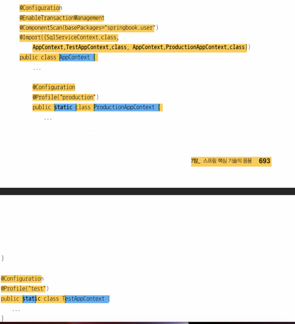

# 1.8 XML 을 이용한 설정
- DI 컨테이너를 사용하면서 오브젝터 사이의 의존정보를 일일이 자바로 만들기 번거롭다
- 대부분 틀에 박힌 구조의 반복이다
- DI 구성이 바뀔때마다 자바 코드를 수정하고 클래스를 다시 컴파일하는 것도 귀찮은 작업이다
- 다양한 방법으로 DI 의존관계 설정정보를 만들 수 있다
- 가장 대표적인 방법이 XML 이다.
- XML 은 단순한 텍스트 파일이다
- 컴파일과 같은 별도의 빌드 작업이 없다
- 환경이 달라져 오브젝트 관계가 바뀌어도 빠르게 요구사항 반영이 가능하다
- 스키마나 DTD 를 통해 정해진 포맷을 따라 작성됐는지 손쉽게 확인이 가능하다

## 1.8.1 XML 설정
- 스프랭 애플리케이션 컨텍스트는 XML 에 담긴 DI 정보를 활용할 수 있다.
- @Bean 메소드를 통해 얻을 수 있는 빈의 DI 정보는 3가지이다
  - 빈의 이름 : @Bean 메소드 이름. getBean()에서 사용된다.
  - 빈의 클래스 : 빈 오브젝트를 어떤 클래스를 이용해서 만들지를 정의
  - 빈의 의존 오브젝트 : 빈의 생성자나 수정자 메소드를 통해 의존 오브젝트를 넣어준다. 의존 오브젝트도 하나의 빈으로 이름이 있을것이고 그이름에 해당하는 메소드를 호출해 의존 오브젝트를 가져온다. 의존 오브젝트는 하나 이상일 수 있다.

### connectionMaker() 전환
- DaoFactory의 connectionMAker() 메소드에 해당하는 빈을 정의해 보자
  - 빈설정 파일 - @Configuration - <beans>
  - 빈의 이름 - @Bean methodName() - <bean id = "methodName"
  - 빈의 클래스 - return new BeanClass() - class= "a.b.c... BeanClass">
- <bean> 태그의 class 애트리뷰트에 지정하는 것은 자바 메소드에서 오브젝트를 만들 때 사용하는 클래스 이름이다
- 메소드 리턴 타입을 class 애트리뷰트에 사용하지 않도록 하자
- XML에서 리턴하는 타입은 지정하지 않아도 된다.
- class 애트리뷰트에 넣을 클래스 이름은 패키지까지 모두 포함해야 한다.


### UserDao() 전환
- UserDao() 에는 DI 정보의 세가지 요소가 모두 들어 있다.
- 수정자 메소드를 사용해 의존관계를 주입하였다는 것에 집중하다
- 수정자 메소드는 프로퍼티가 된다.
- 프로퍼티 이름은 메소드 이름에서 set 을 제외한 나머지 부분을 사용한다.
- XML 에서는 <property> 태그를 사용해 의존 오브젝트와의 관계를 정의한다
- <property> 태그는 name, ref 2개의 애트리뷰트를 갖는다.
- name : 프로퍼티의 이름 - 이를 통해 수정자 메소드를 알 수 있다.
- ref : 수정자 메소드를 통해 주입해줄 오브젝트의 빈 이름


### XML 의존관계 주입 정보
- name 애트리뷰트는 DI에 사용할 수정자 메소드의 프로퍼티 이름이다
- ref 애트리뷰트는 주입할 오브젝트를 정의한 빈의 ID 이다
- 같은 인터페이스를 구현한 의존 오브젝트를 여러 개 정의해두고 그중에서 원하는 걸 골라서 DI 하는 경우도 있다.



## 1.8.2 XML 을 이용하는 애플리케이션 컨텍스트
- 애플리케이션 컨텍스트가 DaoFactory 대신 XML 설정정보를 활용하도록 만들어보자
- GenericXmlApllicationContext 의 생성자 파라미터로 XML 파일의 클래스패스를 지정해 두면 된다.
```java
AppicationContext context = new GenericApplicationContext("applicationContext.xml";)
```
- ClassPathXmlApplicationContext 를 이용해 XML 로부터 설정정보를 가져오는 애플리케이션 컨텍스트를 만들 수도 있다.

## 1.8.3 DataSource 인터페이스로 변환
### DataSource 인터페이스 적용
- ConnectionMaker 는 DB 커넥션을 생성해주는 기능 하나만을 정의한 매우 단순한 인터페이스다.
- 다양한 구현체가 있으니 그냥 골라 쓰자
- 우리는 getConnection() 메소드에 집중해보자

### 자바 코드 설정 방식
- DB 연결과 관련된 정보를 수정자 메소드를 이용해 지정해야 한다.


### XML 설정 방식
- dataSource 라는 이름의 <bean>을 등록한다
- 문제는 DB 접속정보가 나타나지 않는다!


## 1.8.4 프로퍼티 값의 주입
### 값 주입
- 단순 정보도 오브젝트를 초기화하는 과정에서 수정자 메소드에 넣을 수 있다.
- 클래스 외부에서 DB 연결정보와 같이 변경 가능한 정보를 설정할 수 있게 하기 위해서다
- 즉 DB 접속 아이디가 바뀌어도 클래스 코드는 수정할 필요없게 하기 위해
- 즉 사용한 로브젝트자체를 바꾸지는 않지만 오브젝트의 특성은 외부에서 변경할 수 있기 때문이다
- 레퍼런스가 아닌 단순 값이므로 ref 대신 value 애트리뷰트를 활용한다.


### value 값의 자동 변환
- 스프링은 프로퍼티의 값을, 수정자 메소드의 파라미터 타입을 참고로 해서 적절한 현태로 변환해준다
- 또한 텍스트 값을 적절한 자바 타입으로 변환한다
- 기본 타입 뿐만아니라 Class, URL, File, Charset 같은 오브젝트, List, Map, Set 같이 값이 여러개도 커버 가능하다

# 1.9 정리
- 책임 분리로 클래스 분리
- 전략패턴활용(바뀌는 쪽의 인터페이스 적용후 클라이언트의 코드 수정 제거)
- 개발 폐쇄 원칙 : 확장성 높여라 with 다형성
- 낮은 결합도와 높은 응집도를 유지 with 느슨한 결합
- 오브젝트 생성 및 관계를 맺는 작업은 제어의 역전으로 해당 책임으로부터 자유로워지자
- 싱글톤은 문제가 있지만 스프링 컨테이너는 극복 가능
- 컴파일 시점과 런타임시점의 차이를 활용한 느슨한 결합
- 의존 오브젝트 주입시 생성자와 수정자 메소드 활용방법
- XML 방법도 알아보았다.


- 스프링 :어덯게 오브젝트가 설계되고, 만들어지고, 어떻게 관계를 맺고 사용되는지에 관심을 갖는 프레임워크이다!
- 스프링의 관심은 오브젝트와 그 관계이다!
- 그 속에서 좋은 설계 코드 유지 등은 개인의 역량이다