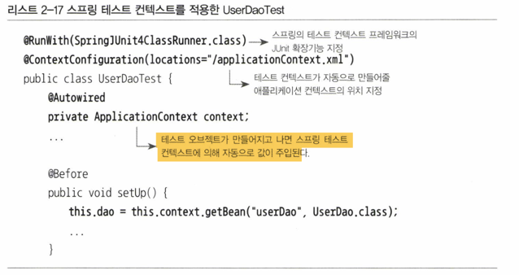
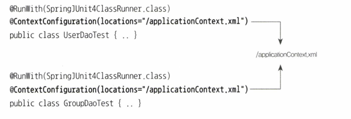
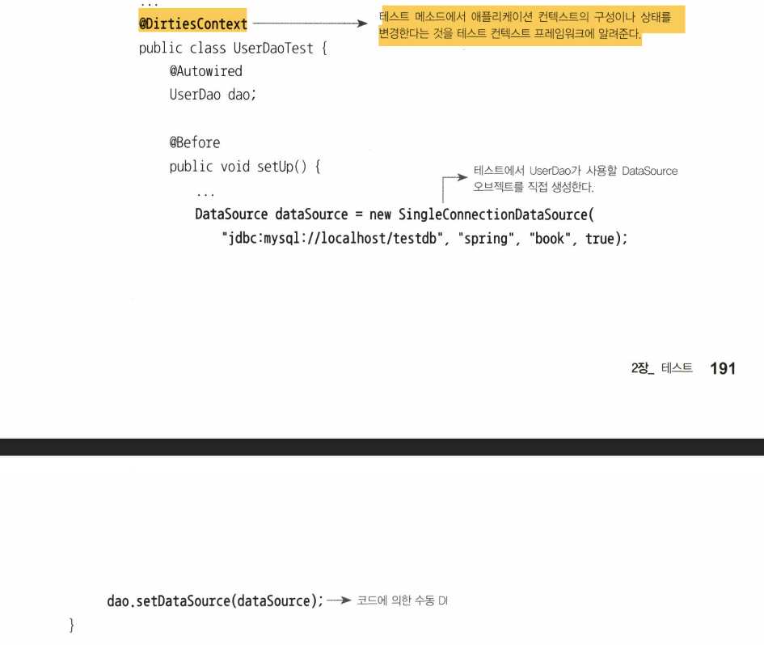
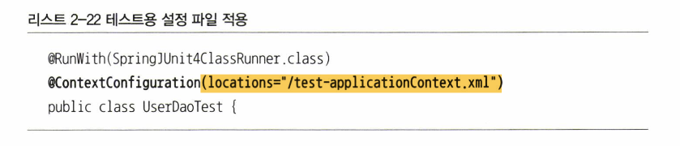
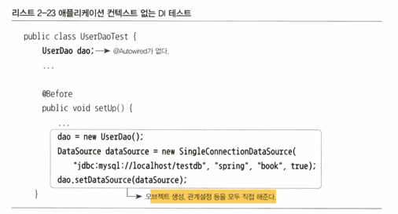

# 스프링 테스트 적용
- 애플리케이션 컨텍스트 생성 방식에 대해 고민해 보자
- 빈이 많아지고 복잡해지면 애플리케이션 컨텍스트 생성에 시간이 많이 든다
- 또한 애플리케이션 컨텍스트 생성시 모든 싱글톤 빈 오브젝트를 초기화한다.
- 즉 특정 빈은 초기화 시간이 오래 걸릴 수 있다.
- 또한 테스트 종료 후 애플리케이션 컨텍스트의 리소르를 깔끔히 정리하지 않으면 다음 테스트에 문제가 발생할 수 있다.
- 문제는 바로 JUnit 이 매번 테스 클래스의 오브젝트를 새로 만든다는 것이다
- 그렇다면 스태틱 필드에 컨텍스트를 저장할까?
- 이보다는 스프링이 직접제공하는 애플리케이션 컨텍스트 테스트 지원기능을 활용해 보자

# 2.4.1 테스트를 위한 애플리케이션 컨텍스트 관리
- @Autowired 와 @RunWith @ContextConfiguration 애노테이션을 활용하자

- @RunWith : JUnit 프레임워크 테스트 실행 방법을 확장할 때 사용하는 애노테이션이다
- SpringJUnit4ClassRunner 지정 시 JUnit이 테스트 진행하면서 컨텍스트를 관ㄹ한다
- @ContextConfiguration : 컨텍스트 설정파일의 위치
- 이를 통해 모든 Context 를 동일하게 사용할 수 있다.
- 즉 맨 처음 실행 시만 컨텍스트를 만들고 그 후부터는 테스트 오브젝트가 만들어질 때마다 특별한 방법으로 컨텍스트를 테스트 오브젝트의 특정 필드에 주입한다 일종의 DI 개념이다

### 테스트 클래스의 컨택스트 공유
- 같은 설정 파일 사용 시 컨텍스트 공유한다

### @Autowird
- 스프링의 DI 에 사용되는 애노테이션
- 변수 타입이 동일한 빈을 찾는다
- 동일 타입이 2개 이상시 변수의 이름으로 찾는다
- 변수 이름도 2개 이상시 예외 발생
- 스프링 애플리케이션 컨텍스트는 초기화 시 자기 자신도 빈으로 등록한다 알아두자

## 2.4.2 DI 와 테스트
왜 우리는 느슨한 결합인 DI 를 써야할까?
1. 소프트웨어 개발에서 절대 바뀌지 않는 것은 없다
2. 클래스의 구현방식은 바뀌지 않는다고 하더라도 인터페이스를 두고 DI 를 적용 할 떄 다른 차원의 서비스 기능을 도입할 수 있다
3. 테스트 때문이다 - 자동으로 실행 가능하며 빠르게 동작하기 위해 작은 단위 대상으로 테스트를 해야 한다.

### 테스트 코드에 의한 DI
테스트를 위해 수동 DI 를 적용해야 하는 경우가 있다

- 위 방법은 xml 설정파일을 수정하지 않고도 테스트 코드를 통해 오브젝트 관계를 재구성할 수 있다.
- 하지만 xml 파일의 설정정보로 구성한 의존관계를 강제로 변경했기 때문에 조심해야 한다
- 애플리케이션 컨텍스트의 구성이나 상태를 테스트 내에서 변경하지 않는 것이 원칙이다
- 강제로 변경시 나머지 모든 테스트를 수행하는 동안 변경된 컨텍스트가 계속 사용될것이다
- 따라서 @DirtiesContext 애노테이션을 추가했다.
- 해당 애노테이션은 컨텍스트가 변경되었기때문에 컨텍스트 공유를 허용하지 않는다
- 클래스 레벨 메소드 레벨 둘다 가능하다

### 테스트를 위한 별도의 DI 설정
- 그냥 xml 을 테스트 용으로 만들고 xml 을 바꿔치기 하자
- 테스트 코드 수정할 필요도 없고 수동 DI 나 @DirtiesContext 도 필요 없다

### 컨테이너 없는 DI 테스트
- 아예 스프링 컨테이너를 사용하지 않고 테스트를 만들 수 있다
- (굳이? 편하게 살자 인생)
- @RunWith, @Autowired 둘다 사용하지 않는다
- 대신 @Before 메소드에 직접 오브젝트를 생성하고 테스트용 오브젝트를 DI 한다

- 직접 설정해야하는 번거로움은 있지만 앺ㄹ리케이션 컨텍스트를 아예사용하지 않아 코드가 더 단순하고 이해하기 쉽다
- 컨텍스트 만드는 번거로움이 없어 테스트 시간도 절약가능하다
- 매번 새로운 오브젝트를 만들긴하지만 가벼운 오브젝트라 큰 부담은 없다
- 결론적으로 테스트 하기 좋은 코드가 좋은 코드이다

### DI 를 이용한 테스트 방법 선택
- 기본적으로 컨테이너 업싱 테스트할 수 있는 방법을 가장 우선적ㅇ로 고려하. 테스트 속도도 빠르고 가장 간결하다
  - 근데 굳이? 편한거 하자! 도구에 파워가 계속 강력해지고 있다...
- 여러 오브젝트와 복잡한 의존관계를 갖는 오브젝트 테스트해야 할때는 스프링의 설정을 이용한 DI 가 편하다
- 예외적으로 의존관계를 강제로 주입해야 하는 경우 컨텍스트에서 DI 받은 오브젝트에 다시 테스트 코드로 수동 DI 해서 테스트하자

# 2.5 학습 테스트로 배운 스프링
- 학습 테스트 : 자신이 만들지 않은 프레임워크나 제공받은 라이브러리 등에 대해서 테스트 작성
- 학습 테스트의 목적은 자신이 사용할 API 나 프레임워크의 기능을 테스트로 보면서 사용 방법을 익히는 것이다

## 2.5.1 학습 테스트의 장범
- 다양한 조건에 따른 기능을 손쉽게 확인해 볼 수 있다.
  - 학습테스트는 자동화된 테스트 코드로 만들어지기 떄문에 다양한 조건에 따라 기능이 어떻게 동작하는지 빠르게 확인 가능
- 학습 테스트 코드를 개발 중에 참고할 수 있다.
  - 다양한 기능과 조건에 대한 테스트 코드를 개별적으로 만들고 남길 수 있다.
  - 이렇게 테스트로 새로운 기술의 다양한 기능을 사용하는 코드를 만들어두면 실제 개발에서 샘플코도로 참고 가능하다
- 프레임워크나 제품을 업그레이드할 때 호환성 검증을 도와준다
  - 새로운 버전 등장시 기존 코드가 작동하는지 테스트하는데 학습 테스트를 이용할 수 있다.
- 테스트 작성에 대한 좋은 훈련이 된다.
- 새로운 기술을 공부하는 과정이 즐거워진다

### 학습 테스트 예제

## 2.5.3 버그 테스트
- 버그 테스트 : 코드에 오류가 있을 때 그 오류를 가장 잘 드러내줄 수 있는 테스트
- 버그 테스트는 일단 실패하도록 만들어야 한다.
- 버그가 원인이 되서 테스트가 실패하는 코드를 만드는 것이다
- 버그 테스트가 성공할 수 있도록 애플리케이션 코드를 수정하여 테스트 성공 시 버그는 해결된것이다

### 버그 테스트의 필요성과 장점
- 테스트의 완성도를 높여주다
  - 실패지점에 대한 테스트를 통해 불충분했던 테스트를 보완한다.
- 버그의 내용을 명확하게 분석하게 해준다
  - 어떤 이유에서 문제가 생겼는지 파악하여 버그를 효과적으로 분석가능
- 기술적인 문제를 해결하는데 도움이된다
  - 버그를 알아도 원인파악이 힘든 기술적으로 다루기 힘든 버그를 발견할 수 있다
  - 동일한 문제가 발생하는 가장 단순한 코드와 그에 대한 버그 테스트를 만드는 것이 도움이 된다.

