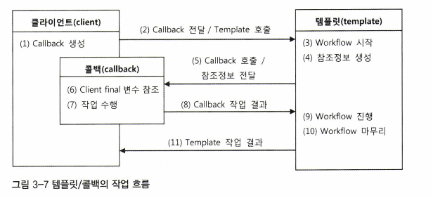
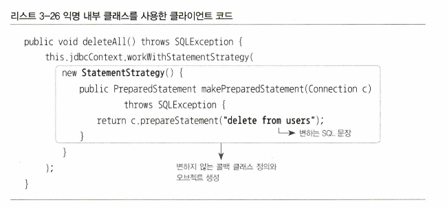
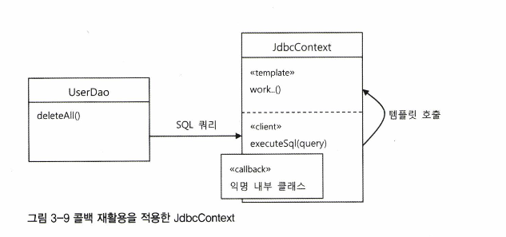
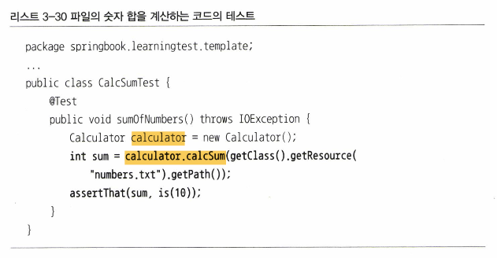
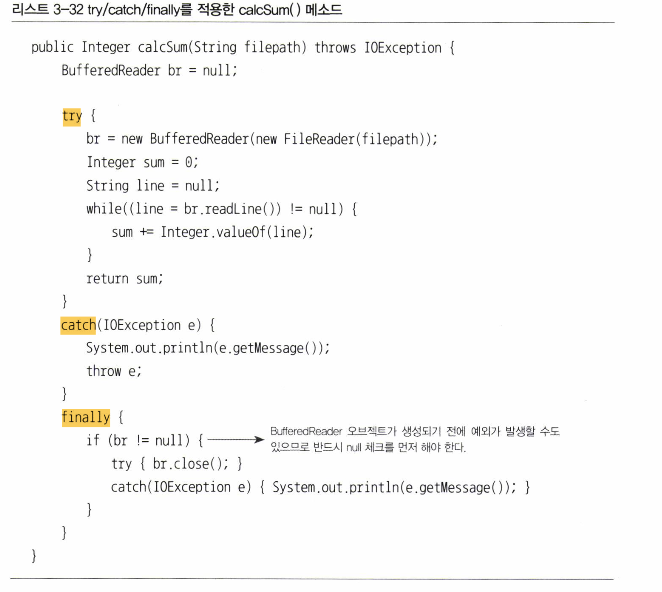
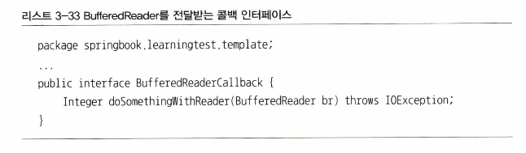
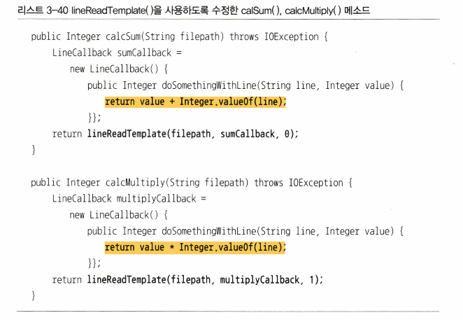

# 3.5 템플릿과 콜백
### 템플릿
- 템플릿은 어떤 목적을 위해 만든 틀. 
- 고정된 틀의 로직을 가진 템플릿 메소드를 슈퍼클래스에 두고, 바뀌는 부분을 서브 클래스의 메소드에 드는 구조 활용

### 콜백
- 실행되는 것을 목적으로 다른 오브젝트의 메소드에 전달되는 오브젝트

## 3.5.1 템플릿/콜백의 동작원리
- 템플릿이라는 흐름에서 자주 여러 부분에서 동시에 활용되는 중복코드를 따로 메소드 즉 콜백으로 분리하여 활용

- DI 구조의 전략 패턴구조로 볼 수 있다.
- 템플릿/콜백의 특징으로 매번 메소드 단위로 사용할 오브젝트를 새롭게 전달받는 것이 특징이다.
- 콜백 오브젝트가 내부 클래스로서 자신을 생성한 클라이언트 메서드 내의 정보를 직접 참조하는 것도 특징이다
- 클라이언트와 콜백이 강하게 결합된다는 것도 특징이다
- 전략 패턴과 DI의 장점을 익명 내부 클래스 사용 전략과 결합한 독특한 방식이다
- 템플릿과 클라이언트가 메소드 단위인 것이 특징이다

## 3.5.2 편리한 콜백의 재활용
## 콜백의 분리화 재활용

- 3-25 을 보면 익명클래스를 활용하여 공통적인 부분을 콜백으로 뺀다.
- 이때 변화하는 부분은 파라미터로 전달하게 변경한다.
- 3-27 을 보면 최종적으로 절대 변하지 않는 콜백 클래스를 정의하게 되고 
- 변하는 부분은 파라미터로 전달하게 된다.
- final 을 통해 해당 파라미터는 반드시 초기화가 진행되야함을 명시한다.

## 콜백과 템플릿의 결합
- 해당 메소드를 JdbcContext 로 옮겼다
- 템플릿은 workWithStatementStrategy() 이므로 그것을 위 클래스로 옮긴거다
- JdbcContext 안에 클라이언트, 템플릿, 콜백이 모두 공존하게 된다.

- 일반적으로 성격이 다른 코드들은 분리하는 것이 낫지만 이경우는 반대라고 한다
- 하나의 목적을 위해 서로 긴밀하게 연관되어 동작하는 응집력이 강한 코드들이기 때문이다.
- 외부에 필요한 기능만 단순한 메소드로 노출한다.

## 3.5.3 템플릿/콜백의 응용
- 스프링의 많은 API 나 기능들이 템플릿/콜백 패턴을 적용한다
- 해당 패턴은 DI와 객체지향 설계를 적극적으로 응용한 결과이다
- 고정된 작업 흐름을 갖고 있으면서 여기저기 자주 반복되는 코드가 있다면 중복되는 코드를 분리하자
- 중복된 코드는 먼저 메소드로 분리하자
- 필요에 따라 바꾸어 사용해야 한다면 인터페이스를 사이에 두고 분리해서 전략 패턴을 적용하고 DI로 의존관계를 관리하자
- **바뀌는 부분이 한 애플리케이션 안에서 동시에 여러 종류가 만들어질 수 있다면 템플릿/콜백 패턴을 적용하자**
- 가장 좋은 예시는 try/catch/finally 블록이다

### 테스트와 try/catch/finally

- 파일을 한줄 씩 읽으면서 더하는 부분이다
- close() 가 반드시 동반되어야 하고 IOException 처리도 필요하다

### 중복의 제거와 템플릿/ 콜백설계
- 더하기 기능을 했는데 곱을 추가해야 한다면?
- 기능이 계속 추가된다면?
- 이럴때 템플릿/콜백 패턴을 적용해 보자
- 템플릿과 콜백의 경계를 정하고 서로 전달하는 내용이 무엇인지 파악하여 콜백의 인터페이스를 정의해야 한다

- 우리는 전달받을 것을 아예 인터페이스 통짜로 설정하였다.
- 왜냐하면 더하기 빼기 곱하기 마다 내부 구현이 다를거기 때문이다

- 그래서 실제로 전달 callback 파라미터는 인터페이스이다. 
- 물론 런타임에는 실제 구현체가 전달될 것이다

- 위와 같이 메소드 내부에서 익명 클래스를 활용하며 이때 우리가 설정한 콜백 인터페이스를 들고 온다
- 그리고 그자리에서 바로 구현을 한다.
- 템플릿은 콜백에서 파라미터로 전달받고 실제 구현내용은 콜백내부에 인터페이스를 활용하여 감춰져있다
- 그리고 인터페이스를 활용하여 DI 적용도 된 전략 패턴이다
- 곱하기는 그 기능만 추가하면 된다

### 템플릿/콜백의 재설계
- 근데 곱하기랑 더하기는 + * 차이이지 또 코드가 중복되네?
- 우리는 템플릿과 콜백의 경계를 찾고 그사이에 전달받을 데이터를 주목하라고 했다
- 실제고 템플릿과 콜백이 주고받는 정보는 결과 합이다.
- 그리고 템플릿은 고정된 틀이고 콜백은 템플릿이 호출하는 부분이다

- 결국 중복되는 부분도 템플릿으로 빼버리고 순수 계산 로직만 콜백으로 가지게 된다
- 그리고 전달 파라미터가 하나 추가되었다
- 즉 템플릿에 파일의 라인을 읽는 작업이 추가된것이다
- 그리고 콜백의 핵심코드는 바로 아래 각각 1줄이다

- 계산 로직만 남아 코드의 관심이 무엇인지 명확하다

### 제너릭스를 이용한 콜백 인터페이스
- 현재 Integer 타입으로 고정되어 있지만 결과의 타입을 다양하게 가지고 올 수도 있다
- 그런경우 제너릭스를 활용하고 String 인 경우에 해당하는 콜백 메소드를 추가하면된다
- 위 코드의 반복이므로 생략한다

