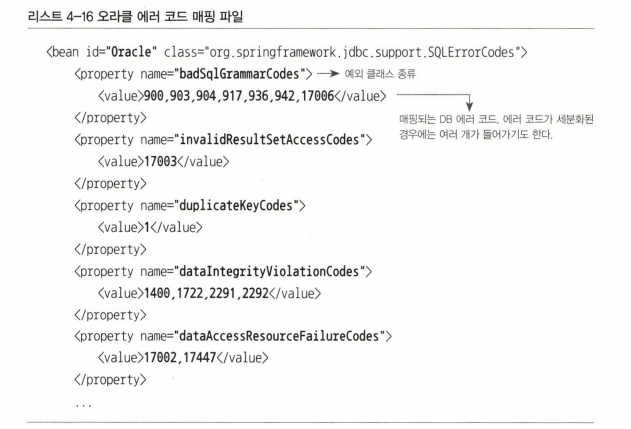
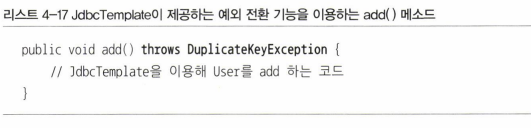
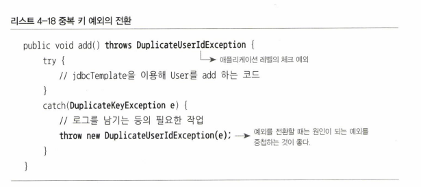
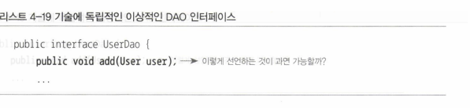
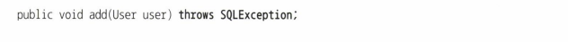
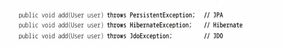
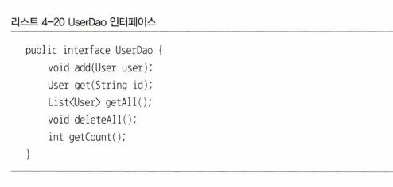
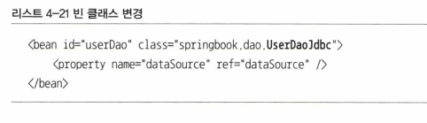
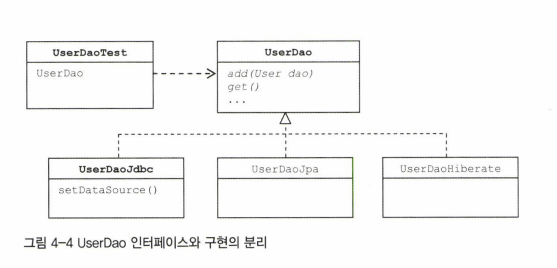

# 4.2 예외 전환
- 예외 전환의 목적은 2가지이다
  1. 런타임 예외로 포장하여 catch/throws 코드 없애기 
  2. 로우레벨의 예외를 좀 더 의미 있는 추상화된 예외로 변경
- 스프링의 JdbcTemplate 이 던지는 DataAccessException 은 런타임 예외로 SQLException 을 포장하는 역할을 한다
- 또한 상세한 예외정보를 의미 있는 예외로 추상화하는 용도로도 쓰인다

## 4.2.1 JDBC 의 한계
- JDBC 는 자바를 통해 DB 접근 방법을 추상화된 API 형태로 정의한다.
- 각 DB 업체는 JDBC 표준을 따라 만든 드라이브를 제공한다.
- JDBC 의 표준 인터페이스를 통해 데이터 액세스 코드를 작성하는 일이 쉬어졌다
- 하지만 2가지 문제가 있다


### 1. JDBC 코드에서 사용하는 SQL에는 비뵤준 문법도 있다.
- SQL 은 표준화된 언어이자만 대부분 DB 는 비표준 문법을 제공한다
- 비표준 SQL 이 DAO 코드에 들어가면 해당 DAO 는 종속적인 코드가 된다.
- DB 변경 가능성이 존재시 문제가 된다.

### 2. 호환성 없는 SQLException 의 DB 에러 정보
- DB 사용시 발생할 수 있는 예외의 원인은 다양하다.
- 문제는 DB 마다 SQL 만 다른 것이 아니라 에러의 종류와 원인도 제각각이다
- 그래서 JDBC 는 데이터 처리중 발생하는 다양한 예외를 SQLException 하나에 모두 담아버린다.
- 즉 JDBC API 는 SQLException 1개만 던지도록 설계되어 있따.
- 예외 발생 원인은 SQLEception 안에 담긴 에러코드 와 SQL 상태정보를 참조해야 한다
  - 하지만 getErrorCoder() 로 가져올 수 있는 DB 에러 코드는 DB 마다 다르다
  - DB 마다 에러코드가 달라지기 때문에 SQL 상태정보도 확인해야 한다.
  - 문제는 **DB의 JDBC 드라이버에서 SQLException 을 담을 상태코드를 정확하게 만들지 않는다**
  - 아예 엉뚱한 값이 있기도 하여 상태코드를 믿고 코드작성은 위험하다

## 4.2.2 DB 에러 코드 매핑을 통한 전환
- DB 종류가 바뀌어도 DAO 를 수정하지 않기 위해 위 2가지 문제를 해결하여 보자
- 상태코드가 믿을 수 없다면 DB 업체별로 만들어 유지해 오는 DB 전용 에러 코드가 더 정확하다
- 따러서 DB 별 에러 코드를 참고해서 발생한 예외의 원인이 무엇이닞 해석해주는 기능을 만들자.

### 스프링
- 스프링은 DataAccessException 이라는 SQLException 을 대체할 수 있는 런타임 예외를 정의할고 있으며
- DataAccessException 의 서브클래스로 세분화된 예외 클래스들을 정의하고 있다.
- 즉 다양한 예외상황을 추상화하여 다양한 예외 클래스를 제공한다.
- **문제는 DB 마다 에러코드가 제각각이다.**
- 일일히 DB 별 에러코드의 종류를 확인하는 작업은 부담스럽다
- 따라서 스프링은 DB 별 에러 코드를 미리 분류해서 스프링이 정의한 예외 클래스와 매핑한 매핑정보 테이블을 활용한다



- 스프링은 단순이 DataAccessException 으로 포장하는 것이 아닌 해당 클래스의 계층구조의 클래스중하나로 매핑해준다.
- 즉 JdbcTemplate 에서 던지는 예외는 모두 DataAccessException 의 서브클래스이다.



- 위와 같이 중복키 상황에 대한 대응이 필요하다면
- DataAccessException 의 서브클래스이면서 미리 추상화되어있는 DuplicateKeyException 을 활용하면 된다.
- 만약 직접 정의한 커스텀 예외를 던지고 싶으면 아래와 같이 활용하자



- JDK 버전이 올라가면서 세분화된 클래스를 제공하기 도 하지만 하지만 SQLExcpeiton 의 서브클래스이며 
- 여전히 체크 예외라는 
- 그 예외를 세분화하는 기준이 SQL 상태정보를 이용한다는 점에서 여전히 문제점이 있다.
- 따라서 스프링이 제공하는 기능을 활용하자

## 4.2.3 DAO 인터페이스와 DataAccessException 계층구조
- DataAccessException 은 SQLException 을 전환하는 용도만 위한게 아니다.
- JDBC 외에 데이터 액세스 기술에서 발생하는 예외에도 적용한다.
- 오라클의 TopLoink, 하이버네이트, MiBatis 등은 사용 방법, 발생 예외가 다르다.
- DataAccessException 은 이러한 데이터 액세스 기술이 달라져도 동일한 예외가 발생하도록 추상화가 진행되어있다.

### DAO 인터페이스와 구현의 분리
- DAO를 따로 만든 이유는 데이터 액세스 로직을 분리하기 위해서이다.
- DAO 사용자는 액세스 방식을 신경쓸 필요가 없다.
- 전략패턴과 DI 를 통해 감출 수 있지만 메소드 선언에 나타나는 예외정보가 문제가 될 수 있다.







- 구현기술마다 던지는 예외가 다르기 때문에 메소드 선언이 달라진다.
- throws Exception 으로 모든 예외를 받을 수 있지만 무책임할 뿐이다.
- 물론 Hibernate, JPA 등은 최신기술로 런타임예외를 던지긴 한다.
- 또한 문제를 해결하기 위해 DAO 메소드 내에서 런타임 예외로 포장할 수도 있다.
- 이재 독립적인 인터페이스 선언은 가능해졌다.
- 문제는 데이터 액세스 기술이 달라지면 다른 종류의 예외를 던진다는 것이다.
- 중복키 에러
  - JDBC : SQLException
  - JPA : PersistenceException
  - Hibernate : HibernateException
- 또 의존성을 띈다
- 즉 인터페이스를 통한 추상화 + 런타임 예외로 전환으로는 부족하다

### 데이터 액세스 예외 추상화와 DataAccessException 계층구조
- 따라서 스프링은 데이터 액세스 기술 활용 시 발생하는 예외를 DataAccessException 계층구조 안에 정리해놓았다.
- 즉 SQLException 의 에러 코드 + 데이터 액세스 관련 예외를 모두 추상화하여 계층구조로 만들어 놨다.
- 예시로 기술마다 다른 종류의 낙관적인 락킹 예외가 발생하지만 스프링은 전부 DataAccessException 의 서브클래스인 ObjectOptimisticLockingFailureException 을 통일적으로 발생시킨다

## 4.2.4 기술에 독립적인 UserDao 만들기
### 인터페이스 적용


- EASY

```java
public class UserDaoJdbc implements UserDao{
```
- 구현체 만든다
- 그 후 빈 클래스를 변경한다



### 테스트 보안
- @Autowired 활용 시 추상 클래스로 선언하면 알아서 해당 타입의 빈을 찾아준다.



- EASY
- 실제로 중복키 오류를 발생시키면 `org.springframework.dao.DuplicateKeyException` 을 던진다
- DataAccessException 의 서브클래스이다

### DataAccessException 활용 시 주의사항
- 안타깝게도 DuplicateKeyException 는 JDBC 사용시만 발생한다
- JPA, Hibernate 등에서 발생하는 예외를 스프링은 DataIntegrityViolationException 으로 변환한다
- 물론 DuplicateKeyException 도 DataIntegrityViolationException 의 한 종류이다.
- 하지만 근본적으로 동일하게 추상화된건 아니다
- 즉 어느 정도 추상화된 공통 예외로 변환하지만 근본적인 한계때문에 완벽하지 않다.
  - hibernate 는 다른상황에서도 동일한 예외를 발생시켜 DuplicateKeyException 을 활용시 가치가 떨어진다.
- 또한 커스텀에도 어느정도 시간이 소요된다.
- 책에서는 SQLException 을 직접 try catch 로 잡아 DataAccessException 으로 바꾸는 예제를 보여준다
- 그냥 스프링이 주는거 가져다 쓰자. 완벽하지 않아도 이보다 더 완벽할 수는 없다

# 4.3 정리
- 런타임예외만 써라
- 포장해서 써라
- SQLException 은 문제가 많다
- 걍 스프링의 DataAccessException 써라
- 정 맘에 안들면 DataAccessException 을 커스텀해서 써라

