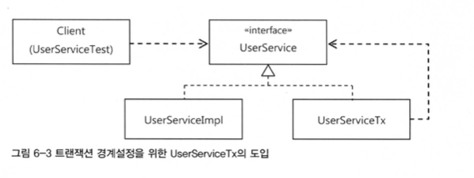
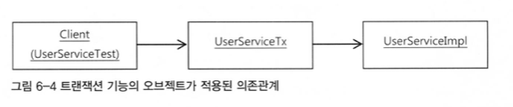

# 6.1. AOP - 트랜잭셔 코드의 분리
- 스프링의 적용된 가장 인기 있는 AOP 적용 대상은 바로 선언적 트랜잭션 기능이다
- 기존코드의 문제점은 UserService 라는 비즈니스 로직 코드에 트랜잭션 경계설정이 들어가있다는 것이다

### 6.1.1 메소드 분리
- 트랜잭션이 적용된 코드는 너무 길고 복잡해보인다
- 해당 부분과 비즈니스 로직을 메소드로 분리하는게 더 좋아보인다

```java
public void upgradeLevels() throws Exception { 
    Transactionstatus status = this.transactionManager.getTransaction(new DefaultTransactionDefinition());
    try {
		// 비지니스 로직 구간
        List<User> users = userDao.getAll(); 
				for (User user : users) {
            if (canUpgradeLevel(user)) { upgradeLevel(user); } 
        }
        this.transactionManager.commit(status); 
		// 비지니스 로직 구간
    } catch (Exception e) {
        this.transactionManager.rollback(status) ;
        throw e; 
    }
}
```
```java
private void upgradeLevelsInternal() { 
    List<User> users = userDao.getAll(); 
    for (User user : users) {
        if (canUpgradeLevel(user)) { 
            upgradeLevel(user);
        } 
    }
}
```

## 6.1.2 DI 를 이용한 클래스의 분리
- 메서드로 따로 분리해 깔끔해 보이지만
- 여전히 트랜잭션을 담당하는 기술적인 코드가 UserService 에 자리잡고 있다
- 그래서 그냥 해당 부분이 안보이게 클래스 밖으로 걍 뽑아버리자

### DI 적용을 이용한 트랜잭션 분리
- 현재 client 는 UserService 를 직접 참고하고 있다.
- 따라서 트랜잭션기능을 빼면 해당 기능이 빠진 UserService 를 사용하게 된다
- 문제다!


- 그래서 우리는 UserService 인터페이스를 통해 약한 결합을 만들것이다
- 보통 구현 클래스를 클라이언트에 노출하지 않기 위해 사용하는 방법이지만
- 꼭 그럴 필요 없잖아?
- 우리는 그냥 두개의 UserService 인터페이스 구현 클래스를 이용할 것이다
- 근데 1개는 비즈니스 로직 담당이고 1개는 트랜잭션 경계설정 기능이다



### UserService 인터페이스 도입
```java
public interface UserService { 
    void add(User user); 
    void upgradeLevels();
}
```
- 실제 사용되는 비즈니스 로직의 메서드들을 인터페이스로 작성한다.

```java
public class UserServicelmpl implements UserService { 
    UserDao userDao;
    MailSender mailSender;
    public void upgradeLevels() {

        List<User> users = userDao.getAll(); 
        for (User user : users) {
            if (canUpgradeLevel(user)) { 
                upgradeLevel(user);
            } 
        }
    }
}
```
- 해당 인터페이스를 implements 하는 구체 클래스를 만든다
- 우리는 여기서 비즈니스 로직을 수행한다
- 그러면 트랜잭션 기능은?

```java
public class UserServiceTx implements UserService { 
    UserService userService; 
    // 바로 이부분에서 우리는 UserSErviceImple 을 받는다
    // 결국 client 는 UserServiceTx 를 사용하고 
    // UserServiceTx - UserServiceImpl - UserService 순서로 의존성을 띄게 된다
    latformTransactionManager transactionManager;
    
    public void setTransactionManager(PlatformTransactionManager transactionManager) {
        this.transactionManager = transactionManager; 
    }

    public void setUserService(UserService userService) { 
        this.userService = userService;
    }

    public void add(User user) { 
        this.userService.add(user);
    }

    public void upgradeLevels() {
        Transactionstatus status = this.transactionManager.getTransaction(new DefaultTransactionDefinitionO);
        try {
            userService.upgradeLevels();
            this.transactionManager.commit(status); 
        } catch (RuntimeException e) {
            this.transactionManager.rollback(status);
            throw e; 
        }
    }
}
```
- UserServiceTx 에서는 비즈니스 로직을 전혀 가지지 않는다
- 비즈니스 로직은 다른 서비스에 위임하고
- 트랜잭션 관련 부분을 담당한다

### 트랜잭션 적용을 위한 DI 설정



- 이런 방향의 의존관계를 가진다
- 따라서 해당 방향으로 스프링 설정파일을 추가한다
- 이제 client 는 UserServiceTx 빈을 호출하여 사용하면된다

### 트랜잭션 분리에 따른 테스트 수정
- @Autowired 는 기본적으로 타입이 일치하는 빈을 찾아주는데
- 스프링의 설정파일에는 UserService 라는 인터페이스 타입을 가진 2개의 빈이 존재한다
- 따라서 client 는 UserService 가 대표하는 빈을 가지고 오지만 목 객체를 사용하기 위해 동시에 MailSender 를 DI 해줄 구체대상도 알아야 해서 UserServiceImpl 클래스의 오브젝트를 가지고 올 필요가 있다
- 단순히 UserService 기능을 사용할때는 문제가 안된다
- 하지만 목 오브젝트로 수동 DI 를 해야 한다면 어느 오브젝트인지 분명히 알아야 한다.
- `@Autowired UserServiceImpl userServiceImpl;`

### 트랜잭션 경계설정 코드 분리의 장점
1. 비즈니스 로직을 담당하고 있는 UserServiceImpl 코드 작성 시 트랜잭션과 같은 기술적인 내용은 신경쓰지 않아도 된다.
2. 비즈니스 로직에 대한 테스트를 손쉽게 만들 수 있다.