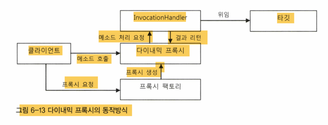
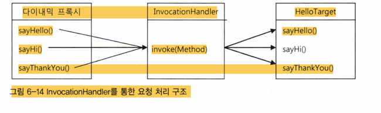
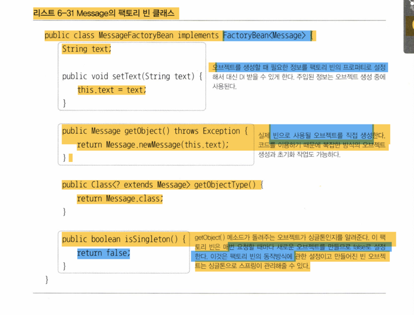
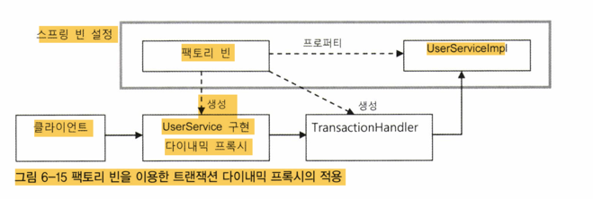
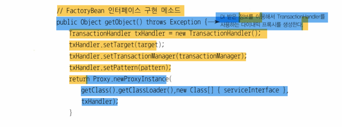

# 6.3.3 복습
- 프록시인 InvocationHandler 를 호출하면 타킷 인터페이스에 해당 기능을 위임한다
- 하지만 프록시는 2가지 문제가 있다
    - 1. 인터페이스의 모든 메소드를 구현해 위임하도록 코드를 만들어야한다
    - 2. 부가기능을 모든 메소드에 추가하면 중복코드가발생(예) 대문자 변경)





- 그래서 우리는 프록시를 프록시 팩토리에 의해 런타임 시 다이나믹하게 만들어지는 다이나믹 프록시를 만들었다
- 리플렉션의 Method 인터페이스의 invoke() 메소드를 통해 중간에서 모두 관리한다

```java
public class UppercaseHandler implements InvocationHandler {
    Hello target;

    public UppercaseHandler(Hello target) { 
        this.target = target;
    }

    public Object invoke(Object proxy, Method method, Object!] args) throws Throwable {
        String ret = (String)method.invoke(target, args);
        return ret.toUpperCase();
    }
}
```
```java
Hello proxiedHello = (Hello)Proxy.newProxyInstance( 
    getClass().getClassLoader(), // 동적으로 생성되는 다이내믹 프록시 클래스의 로딩에 사용할 클래스 로더
    new Class[] {Hello.class}, // 구현할 인터페이스
    new UppercaseHandler (new HelloTarget()));
```
- 다이나믹 프록시의 생성은 Proxy 클래스의 newProxyInstance() 스태틱 팩토리 메소드를 이용한다
- 다이나믹 프록시의 장점
  - 1. 타킷의 종류에 상관없이 적용이 가능하다
  - 2. 단일 메소드에서 모두 처리하기 때문에 어떤 메소드에 어떤 기능을 적용할 지 선택 가능
  - 3. 리턴 타입 뿐 아니라 메소드의 이름도 조건으로 걸 수 있다

# 6.3.4 다이내믹 프록시를 위한 팩토리 빈
- 이제 Handler 즉 다이내믹 프록시를 스프링의 DI를 통해 사용하고자 한다
- 스프링의 빈은 기본적으로 클래스 이름과 프로퍼티로 정의된다.
- 스프링은 내부적으로 리플렉션 API를 이용해서 빈 정의에 나오는 클래스 이름을 가지고 빈 오브젝트생성
- 문제는 다이내믹 프록시 오브젝트 클래스가 어떤것인지 알 수 없다
- 다이내믹 프록시는 Proxy 클래스의 newProxyInstance() 스태틱 팩토리 메소드로만 만들 수 있기 때문이다

## 팩토리 빈
- 팩토리 빈으로 해결하자
- 스프링의 FactoryBean 이라는 인터페이스 구현이다

```java

package org.springframework.beans. factory;
public interface FactoryBean<T> { 
    T getobject() throws Exception; //빈오브젝트를생성해서돌려준다.
    Class<? extends T> getObjectType(); //생성되는오브젝트의타입을알려준다.
    boolean isSinaleton(); //getObect()가돌려주는오브젝트가항상같은싱글톤오브젝트인지알려준다.
```



- 팩토리 빈 클래스의 오브젝트의 getObject() 메소드를 이용해 오브젝트를 가져오 이를 빈 오브젝트로 사용한다

## 팩토리 빈의 설정 방법
- id, class 애트리뷰트로 지정한다
- 빈 오브젝트의 타입은 Bean 이 아닌 Class 이다
- 즉 FactoryBean 인터페이스를 구현한 클래스를 스프링 빈으로 만들어두면 getObject() 라는 메소드가 생성해주는 오브젝트가 실제빈의 오브젝트로 대치된다
- 만약 Bean 자체를 가지고 오고 싶은 경우 '&'를 빈 이름 앞에 붙이면 된다

## 다이내믹 프록시를 만들어주는 팩토리 빈
- 팩토리 빈을 사용해 다이나믹 프록시 오브젝트를 스프링의 빈으로 만들 수 있다.
- 팩토리 빈의 getObejct() 메소드에 다이내믹 프록시 오브젝트를 만들어주는 코드를 넣으면 된다



- 스프링 빈에는 팩토리 빈과 UserServiceImpl만 빈으로 등록한다
- 팩토리 빈은 타킷 오브젝트의 레퍼런스를 프로퍼티를 통해 DI 받아둔다.
  - 프록시(다이나믹 프록시와 함께만들어질)에게 타킷 오브젝트를 전달해야하기 때문

## 트랜잭션 프록시 팩토리 빈



- 팩토리 빈의 getObejct() 메소드에 다이내믹 프록시 오브젝트를 만들어주는 코드가 들어가는 것을 볼 수 있다.

## 트랜잭션 프록시 팩토리 빈 테스트
- 프록시는 포록시 빈 내부로 만들어져 사용된다.
- 즉 별도로 참조할 방법이 없다
- 테스트용 설정이나 프록시 팩토리 빈코드를 확장가능하지만 너무 번거롭다
- 그냥 빈으로 등록된 팩토리 빈을 직접 가져와서 프록시를 만들어 테스트 할 수 있다

# 6.3.5 프록시 팩토리 빈 방식의 장점과 한계
## 프록시 팩토리 빈의 재사용
- 팩토리 빈은 코드의 수정없이도 다양한 클래스에 적용할 수 있다
- 타킷 오브젝트를 프로퍼티정보를 설정해 빈으로 등록하면 끝이다
- 하니 이상의 팩토리 빈을 동시에 등록해도 무관
- 어차피 타킷 인터페이스는 동일하니
- 코드 한줄 수정없이 그냥 바꿔끼워도 무관

## 프록시 팩토리 빈 방식의 장점
- 기존 문제점은 2개다
  - 1. 프록시를 적용할 대상이 구현하고 있는 인터페이스를 구현하는 프록시 클래스를 일일이 만들어야 하는 번거로움
  - 2. 부가적인 기능이 여러 메소드에 반복적으로 나타나는 코드 중복의 문제
- 다이나믹 프록시를 이용하면 타킷 인터페이스를 구현하는 클래스를 인일이 만드는 번거로움 제거 가능
- 하나의 핸들러 메서드구현하면 수많은 메서드 부가기능을 부여해 부가기능 코드 중복 문제도 사라진다
- 다이나믹 프록시 팩토리 빈을 이용해 DI 까지 하면 번거로운 다이나믹 프록시 생성 코드도 제거 가능

## 프록시 팩토리 빈의 한계
- 타깃에 부가기능을 제공하는 것은 메소드 단위이다
- 한번에 여러 개의 클래스에 공통적인 부가기능 제공은 불가능
- 하나의 타킷에 여러 부가기능을 적용할려면 설정이 엄청많아질수있다
  - xml 설정도 많아지면 관리가 어렵다..
- 프록시 오브젝트가 팩토리 빈 개수만큼 만들어진다
- 프록시 오브젝트는 만약 타킷 오브젝트가 달라지면 동일 코드임에도 불구하고 계속 만들어져야 한다
  - 타킷 오브젝트가 다르면 그만큼 다른 빈으로 등록해야한다..