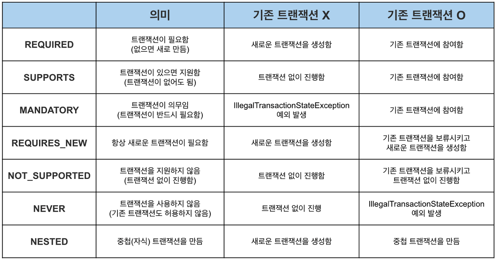
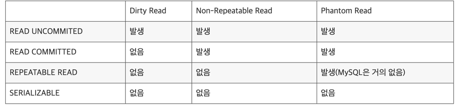

# 6.5.5 AOP 적용기술
## 프록시를 이용한 AOP
- AOP 의 핵심은 프록시를 이용했다ㅡㄴ 것이다
- 스프링 AOP는 자바의 기본 JDK 와 스프링 컨테이너 외에는 특별한 기술이나 환경을 요구하지 않는다
- 스프링 AOP의 부가기능을 담은 어드바이스가 적용되는 대상은 오브젝트의 메소드이다
- 프록시 방식을 사용했기 때문에 메소드 호출 과정에 참여해서 부가기능을 제공해주게 되어 있다
- 독립적으로 개발한 부가기능 모듈을 다양한 타킷 오브젝트의 메소드에 다이내믹하게 적용하기 위해 사용되는 것이 프록시이다!

## 바이트코드 생성과 조작을 통한 AOP
- 프록시가 아닌 타킷 오브젝트를 뜯어 부가 기능을 직접 넣어주는 직접적인 방법이 있다
- 컴파일된 타킷의 클래스 파일자체를 수정하거나 클래스가 JVM 에 로딩되는 시점을 가로채 바이트코드를 조작하는 복잡한 방법이다

### 바이트 코드 장점
1. 스프링과 같은 DI 를 통안 프록시 생성 없이 타깃 오브젝트를 직접 수정하여 AOP 가 가능하여 스프링과 같은 컨테이너가 사용되지 않는 환겨에서 손쉽게 AOP 사용가능하다
2. 프록시 AOP 는 부가기능 부여 대상이 메소드에 제한되지만 바이트코드를 직접 조작하면 오브젝트의 생성, 필드 값 조회 조작, 스태틱 초기화 등 다양한 작업에 부가기능 부여가 가능하다
   - 프록시 적용이 불가능한 부분도 바이트 코드 직접 조작으로 처리가능

# 6.5.6 AOP 의 용어
- 타깃 : 부가기능을 부여한 대상
- 어드바이스 : 타깃에게 제공할 부가기능을 담은 모듈
- 조인 포인트 : 어드바이스가 적용될 위치(스프링 프록시는 메소드 실행단계)
- 포인트컷 : 어드바이스를 적용할 조인 포인트를 선별하는 작업 또는 그 기능을 정의한 모듈
- 프록시 : 클라이언트와 타깃 사이에 투명하게 존재하는 부가기능을 제공하는 오브젝트
- 어드바이저 : 포인트컷, 어드바이스를 하나씩 갖고 있는 오브젝트
- 애스펙트 : AOP의 기본 모귤로 한개 똔느 그이상의 포인트컷과 어드바이스의 조합으로 만들어지며 보통 싱글톤 형태의 오브젝트로 존재한다

# 6.5.7 AOP 네임스페이스
- 스프링 AOP 를 적용하기 위해 추가한 어드바이저, 포인트컷, 같은 빈들은 로직 빈과는 성격이다르다
- 이런 빈들은 스프링 컨테이너에 의해 자동으로 인식외어 특별한 작업을 위해 사용된다
- 스프링의 프록시 방식 AOP를 적용하기 위해서는 최소 4가지 빈을 등록해야 한다
1. 자동 프록시 생성기
- 스프링의 DefaultAdvisorAutoProxyCreator 클래스를 빈으로 등록
- 다른 빈을 DI 하지도 않고 자신도 DI 되지 않으며 독립적으로 존재
- 빈으로 등록된 어드바이저를 이용해 프록시를 자동 생성하는 기능
2. 어드바이스
- 부가기능을 구현한 클래스를 빈으로 등록
3. 포인트컷
- 스프링의 AspectJExpressionPointcut 을 빈으로 등록하고 expression 프로퍼티에 포인트컷 표현식 추가
4. 어드바이저
- 스프링의 DefaultPointcutAdvisor 클래스를 빈으로 등록하여 사용
- 어드바이스와 포인트컷을 프로퍼티로 참조하는 것 외에는 기능이 없다

이중 부가기능을 담은 코드로 만든 어드바이스를 제외한 나머지 세가지는 모두 스프링이 직접 제공하는 클래스를 빈으로 등록 프로퍼티 설정만 한다

## AOP 네임스페이스
- 스프링은 AOP 를 위해 기계적으로 적용하는 빈들을 간편하게 등록할 수 있다
- 스프링은 AOP 와 관련된 태그를 정의해둔 aop 스키마를 제공
- aop 네임스페이스를 이용해 기존 AOP 관련 빈 설정을 변경 가능하다
- <aop:config>, <aop:pointcut),<aop:advisor>세가지 태그를 정의해두면 그에 따라 세개의 빈이 자동으로 등록된다.
- 포인트컷이나 어드바이저, 자동 포인트컷 생성기 같은 특별한 기능을 가진 빈들은 별도의 스키마에 정의된 전용 태그를 사용해 정의해두면 편리하다

## 어드바이저 내장 포인트컷
- AspectJ 포인트컷 표현식을 활용하는 포인트컷은 스프링으로 된 표현식을 담은 expresson 프로퍼티 하나만 설정해두면 사용할 수 있다
- 포인트컷은 어드바이저에 참조되어야함 사용되므로 aop스키마의 전용 태그를 사용하는 경우 어드바이저 태그와 결합하는 방법도 가능
- 이런경우 태그가 하나 줄어 간결하게 사용 가능

# 6.6.1 트랜잭션 정의
- 트랜잭션 : 더이상 쪼갤수 없는 최소 단위의 작업
- commit() 혹은 rollback() 작업이 필수이다
- 4사지 속성이 정의된다
## 트랜잭션 전파
- 트랜잭션 경계에서 이미 진행 중인 트랜잭션이 있을떄 또는 없을때 어떻게 동작할지 결정하는 방식이다
- A 가 다 안끝났는데 B 를 호출하면 B 는 어떤 트랜잭션에서 동작해야 할까?

## 격리 수준
- 여러개의 트랜잭션이 동시에 진행될 수있다
- 순차적으로 진행시 성능이 떨어지므로 적절한 격리수준 조정을 통해 가능한 많은 트랜잭션을 동시에 진행시키면서 문제없는 제어가 필요하다

## 제한시간
- 트랜잭션 수행 제한시간 설정이 가능하다

## 읽기전용
- read only 를 통해 트랜잭션 내에서 데이터 조작시도를 막을 수 있다