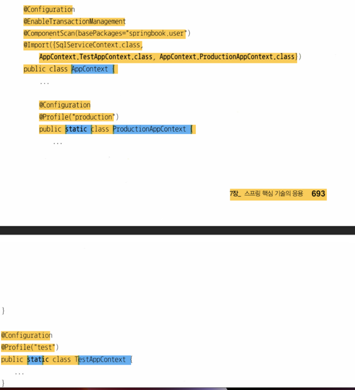

# 7.6.3 컨텍스트 분리와 @Import
- 테스트 용도의 빈은 실제 애플리케이션에 포함되면 안된다.
- 메일 발송 기능 담당 빈은 테스트용으로 만든 더미 오브젝트를 활용했다
- 즉 애플리케이션에 필요한 DI 정보와 테스트 수행을 위한 DI 정보가 하나의 파일에 호재되어있다
- 성격이 다른 DI 정보를 분리하자

## 테스트용 컨텍스트 분리
- DI 설정 클래스를 추가하고 관련된 빈 설정 애노테이션, 필드, 메소드를 옮기자

### 방법
- TestApplicationContext -> AppConext
- 테스트 정보를 분리하자
```java
@Configuration
    public class TestAppContext {
    @Autowired UserDao u s e r D a o ;
    
    @Bean
    public UserService testUserService() {
        TestUserService testService = new TestUserService(); 
        testService.setUserDao(this.userDao); 
        testService.setMailSender (mailSender ());
        return testService;
    }
    @Bean
    public MailSender mailSender ( ){
    return new DummyMailSender();
    }
};
```
- testUserService 는 mailSender 빈에 의존하니 해당 빈 정의 메서드도 작성
- testUserService 는 UserServiceImpl 을 상속하니 userDao 프로퍼티는 자동 와이어링 대상이다
- 따라서 testUserService 를 그냥 TestUserService 로 받아도 된다
```java
@Bean
public UserService testUserService() {
  return new TestUserService();
}

```
- @Component, @ComponentScan 활용시 기준 패키지를 지정해 클래스를 찾는다
- 현재 테스트용 빈은 설정정보가 없는게 낫다.
- 패키지가 분리되고 설정정보 노출이 되어도 상관없을때 활용하자
- 테스트 코드에 넣은 DI 정보용 클래스도 수정해야 한다
```java
@RunWith(SpringJUnit4ClassRunner.class)
@ContextConfiguration(classes=(TestAppContext.class,AppContext.class]) 
public class UserDaoTest {
```
## Import
- SQL 서비스용 빈처럼 독립적임 모듈로 취급할 필요가 있을수 있다.
- 독립적으로 개발되거나 변경될 가능성이높으면 분리하자
- 그냥 @Configuration 클래스로 분리하면 된다
- 그러면 최종적으로 DI 정보 담은 클래스가 3개이다
- 테스트용 설정정보는 애플리케이션 설정정보와 깔끔하게 분리되는것이 낫다
- AppContext 가 메인 설정정보가 되고
- SqlServiceContext 는 AppContext 에 포함되는 보조 설정정보로 @Import 를 활용하자
```java
@Configuration
@EnableTransactionManagement
@ComponentScan (basePackages="springbook.user") 
@Import (SqlServiceContext.class)
public class AppContext
```
# 7.6.4 프로파일
- 테스트용 mail 은 더미 빈이었다
- 근데 운영에는 진짜 MailSender 타입 빈이 필요하다
```java
@Bean
public MailSender mailSender (){
    JavaMailSender Impl mailSender = new JavaMailSender Imp1 (); 
    mailSender.setHost("mail.mycompany.com");
    return mailSender;
}
```
- 이러면 테스트용 빈 과 충돌이 생긴다
- 스프링이 정보를 읽는 순서에 따라 앞의 빈이 우선시 되기 때문이다
- 즉 테스트환경과 운영환경에서 각기 다른 빈 정의가 필요한 경우가 있다

## @Profile 과 @ActiveProfiles
- 스프링은 간단히 설정정보를 구성할 수 있는 방법을 제공
- 빈 구성이 달라지는 내용을 프로파일로 정의해서 만들어두고
- 실행 시점에 어떤 프로파일의 빈 설정을 사용할지 지정
- 프로파일 적용시 하나의 설정 클래스만 가지고 환경에 따라 다른 빈설정 조합 가능
```java
@Configuration 
@Profile("test")
public class TestAppContext {
```
- TestAppContext 는 test 프로파일에 분류

```java

@Configuration
@EnableTransactionManagement
@ComponentScan (basePackages="springbook.user")
@Import ((SqlServiceContext.class, TestAppContext.class, ProductionAppContext.class))
public class AppContext {
```
- AppContext 에서 모든 설정 클래스를 import 하고 있다
- 따라서 AppContext 만 가져다 사용하자
```
@ContextConfiguration(classes=AppContext.class)
```
- 테스트 시 TestAppContext 는 프로파일로 지정이 되어있어 에러가 난다

```text
@RunWith(Spring]Unit4ClassRunner.class) 
@ActiveProfiles("test")
@ContextConfiguration(classes=AppContext.class) 
public class UserServiceTest {
```
- @ActiveProfiles 로 활성화 시키자
- 잘 된다 이제!

## 컨테이너의 빈 등록 정보 확인
- DefaultListableBeanfactory 에 리스트로 관리
- 가져와서 리스트 출력하면 된다

## 중첩 클래스를 이용한 프로파일 적용
- 1개의 파일로 구조를 보고 싶은 경우
- 중첩 클래스로 적용할 수 있다


