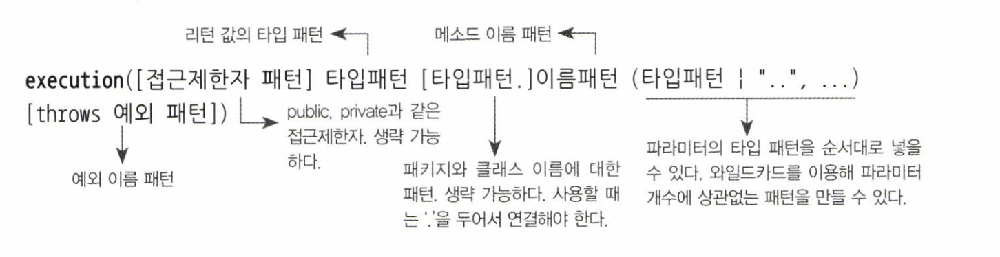
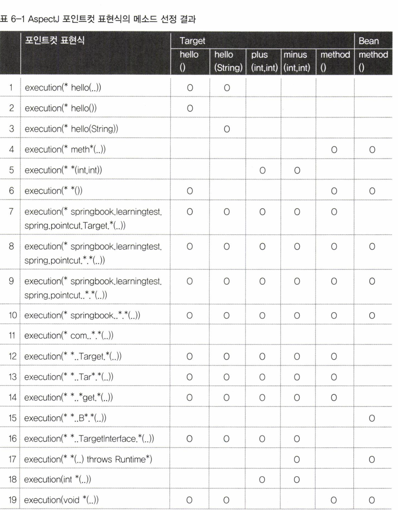

# 6.5 스프링 AOP

## 6.5.1 자동 프록시 생성

프록시 팩토리 빈 방식의 접근 방법의 한계라고 생각했던 두 가지 문제가 있었다. 그중에서 부가기능이 타깃 오브젝트마다 만들어지는 문제는 스프링 ProxyFactoryBean의 어드바이스를 통해 해결됐다.

남은 것은 부가기능의 적용이 필요한 타깃 오브젝트마다 거의 비슷한 내용의 ProxyFactoryBean 빈 설정정보를 추가해주는 부분이다. target 프로퍼티를 제외한 동일한 설정 부분(빈 클래스 종류, 어드바이스, 포인트컷)이 반복되고 있다.

### 중복 문제의 접근 방법

JDK의 다이나믹 프록시는 특정 인터페이스를 구현한 오브젝트에 대해서 프록시 역할을 해주는 클래스를 런타임 시 내부적으로 만들어준다. 그 덕분에 개발자가 일일이 인터페이스 메소드를 구현하는 프록시 클래스를 만들어서 위임과 부가기능의 코드를 중복해서 넣어주지 않아도 되게 해줬다.

변하지 않는 타깃으로의 위임과 부가기능 적용 여부 판단이라는 부분은 코드 생성 기법을 이용하는 다이나믹 프록시 기술에 맡기고, 변하는 부가기능 코드는 별도로 만들어서 다이나믹 프록시 생성 팩토리에 DI로 제공하는 방법을 사용한 것이다.

### 빈 후처리기를 이용한 자동 프록시 생성기

스프링은 컨테이너로서 제공하는 기능 중에서 변하지 않는 핵심적인 부분외에는 대부분 확장할 수 있도록 확장 포인트를 제공해준다.

그중에서 관심을 가질 만한 확장 포인트는 바로 `BeanPostProcessor` 인터페이스를 구현해서 만드는 빈 후처리기다. 빈 후처리기는 스프링 빈 오브젝트로 만들어지고 난 후에, 빈 오브젝트를 다시 가공할 수 있게 해준다.

여기서는 스프링이 제공하는 빈 후처리기 중의 하나인 `DefaultAdvisorAutoProxyCreator`를 살펴본다. 빈 후처리기를 스프링에 적용하는 방법은 간단하다. `빈 후처리기 자체를 빈으로 등록하는 것`이다. 스프링은 빈 후처리기가 빈으로 등록되어 있으면 빈 오브젝트가 생성될 때마다 빈 후처리기에 보내서 후처리 작업을 요청한다.

이를 잘 이용하면 스프링이 생성하는 빈 오브젝트의 일부를 프록시로 포장하고, 프록시를 빈으로 대신 등록할 수도 있다. 바로 이것이 `자동 프록시 생성 빈 후처리기`다.

### 확장된 포인트컷

지금까지 포인트컷이란 타깃 오브젝트의 메소드 중에서 어떤 메소드에 부가기능을 적용할지를 선정해주는 역할을 한다고 했다. 이것과 더불어 포인트컷은 등록된 빈 중에서 `어떤 빈에 프록시를 적용할지를 선택하는 것도 가능`하다.

```java
public interface Pointcut {
  ClassFilter getClassFilter(); //프록시를 적용할 클래스인지를 확인
  MethodMatcher getMethodMatcher(); //어드바이스를 적용할 메소드인지 확인
}
```

Pointcut 선정 기능을 모두(클래스, 메소드) 적용한다면 먼저 프록시를 적용할 클래스인지 판단하고 나서, 적용 대상 클래스인 경우에는 어드바이스를 적용할 메소드인지 확인하는 식으로 동작한다.

### 포인트컷 테스트

```java
@Test
public void classNamePointcutAdvisor() {
  NameMatchMethodPointcut classMethodPointcut = new NameMatchMethodPointcut() {
    public ClassFilter getClassFilter() {
      return new ClassFilter() {
        public boolean matches(Class<?> clazz) {
          return clazz.getSimpleName().startsWith("HelloT"); // 클래스 이름이 HelloT로 시작하는 것만 선정한다.  
        } 
      };  
    } 
  };
  classMethodPointcut.setMappedName("sayH*"); // sayH로 시작하는 메소드 이름을 가진 메소드만 선정한다.

  //적용 클래스다.
  checkAdviced(new HelloTarget(), classMethodPointcut, true);

  class HelloWorld extends HelloTarget {};
  // 적용 클래스가 아니다.
  checkAdviced(new HelloWorld(), classMethodPointcut, false);

  class HelloToby extends HelloTarget {};
  // 적용 클래스다.
  checkAdviced(new HelloToby(), classMethodPointcut, true);
}

private void checkAdviced(Object target, Pointcut pointcut, boolean adviced) {
  ProxyFactoryBean proxyFactoryBean = new ProxyFactoryBean();
  proxyFactoryBean.setTarget(target);
  proxyFactoryBean.addAdvisor(new DefaultPointcutAdvisor(pointcut, new UppercaseAdvice()));

  Hello proxyHello = (Hello)proxyFactoryBean.getObject();

  if (adviced) {
    assertThat(proxyHello.sayHello("Toby"), is("HELLO TOBY")); // 메소드 선정 방식을 통해 어드 바이스 적용
    assertThat(proxyHello.sayHi("Toby"), is("HI TOBY")); // 메소드 선정 방식을 통해 어드 바이스 적용
    assertThat(proxyHello.sayThankYou("Toby"), is("Thank You Toby"));
  } else { // 어드바이스 적용대상이 아니다.
    assertThat(proxyHello.sayHello("Toby"), is("Hello Toby"));
    assertThat(proxyHello.sayHi("Toby"), is("Hi Toby"));
    assertThat(proxyHello.sayThankYou("Toby"), is("Thank You Toby"));
  }
}
```

## 6.5.2 DefaultAdvisorAutoProxyCreator의 적용

### 클래스 필터를 적용한 포인트컷 작성

메소드 이름만 비교하던 포인트컷인 NameMatchMethodPointcut을 상속해서 프로퍼티로 주어진 이름 패턴을 가지고 클래스 이름을 비교하는 ClassFilter를 추가하도록 만든다.

```java
import org.springframework.aop.ClassFilter;
import org.springframework.aop.support.NameMatchMethodPointcut;
import org.springframework.util.PatternMatchUtils;

public class NameMatchClassMethodPointcut extends NameMatchMethodPointcut {

  public void setMappedClassName(String mappedClassName) {
    this.setClassFilter(new SimpleClassFilter(mappedClassName));
  }

  static class SimpleClassFilter implements ClassFilter {

    String mappedName;

    private SimpleClassFilter(String mappedName) {
      this.mappedName = mappedName;
    }

    public boolean matches(Class<?> clazz) {
      return PatternMatchUtils.simpleMatch(mappedName, clazz.getSimpleName());
    }
  }
}
```

### 어드바이저를 이용하는 자동 프록시 생성기 등록

DefaultAdvisorAutoProxyCreator는 등록된 빈 중에서 Advisor 인터페이스를 구현한 것을 모두 찾는다. 그리고 생성되는 모든 빈에 대해 어드바이저의 포인트컷을 적용해보면서 프록시 적용 대상을 선정한다. 빈 클래스가 프록시 선정 대상이라면 프록시를 만들어 원래 빈 오브젝트와 바꿔치기한다.

DefaultAdvisorAutoProxyCreator 등록은 다음 한 줄이면 충분하다.

```xml
<bean class="org.springframework.aop.framework.autoproxy.DefaultAdvisorAutoProxyCreator" />
```

### 포인트컷 등록

```xml
<bean id="transactionPointcut" class="springbook.service.NameMatchCLassMethodPointcut">
  <property name="mappedClassName" value="*ServiceImpl" /> <!-- 클래스 이름 패턴 -->
  <property name="mappedName" value="upgrade*" /> <!-- 메소드 이름 패턴 -->
</bean>
```

### 어드바이스와 어드바이저

어드바이스 transactionAdvice, 어드바이저 transactionAdvisor를 수정할 필요는 없다. 다만 DefaultAdvisorAutoProxyCreator에 의해 어드바이저가 자동으로 수집되고, 프록시에서 사용된다는 것을 기억하자.

### ProxyFactoryBean 제거와 서비스 빈의 원상복구

더 이상 명시적인 프록시 팩토리 빈을 등록하지 않기 때문에 userServiceImpl 빈의 아이디를 이제는 userService로 되돌릴 수 있다.

```xml
<bean id="userService" class="springbook.service.UserServiceImpl">
  <property name="userDao" ref="userDao" />
  <property name="mailSender" ref="mailSender" />
</bean>
```

### 자동 프록시 생성기를 사용하는 테스트

### 자동생성 프록시 확인

무슨 기술이든 자동으로 무엇을 해준다고 하면 정말 그런지 한 번쯤은 직접 확인해보는 습관을 들이는 편이 좋다. 예상한 대로 동작하지 않아도 예외적인 상황이 발생하기 전에는 확인이 되지 않아 심각한 문제를 초래할수도 있기 때문이다.

지금까지 트랜잭션 어드바이스를 적용한 프록시 자동생성기를 빈 후처리기 메커니즘을 통해 적용했다. 최소한 두 가지는 확인해야 한다.

첫째는 트랜잭션이 필요한 빈에 트랜잭션 부가기능이 적용됐는가이다.

둘째는 아무 빈에나 트랜잭션 부가기능이 적용된 것은 아닌지 확인해야 한다.

## 6.5.3 포인트컷 표현식을 이용한 포인트컷

지금까지 사용했던 포인트컷은 단순하게 메소드 이름과 클래스 이름 패턴을 각각 클래스 필터와 메소드 매처 오브젝트로 비교해서 선정하는 방식이었다.

스프링은 더 간단하고 효과적인 방법으로 포인트컷을 작성할 수 있는 방법을 제공한다. 정규식이나 JSP의 EL과 비슷한 일종의 표현식 언어를 사용해서 포인트컷을 작성할 수 있도록 하는 방법이다. 그래서 이것을 `포인트컷 표현식`이라고 부른다. 

### 포인트컷 표현식

포인트컷 표현식을 지원하는 포인트컷을 적용하려면 `AspectJExpressionPointcut` 클래스를 사용하면 된다. 앞에서 살펴봤던 Pointcut 인터페이스를 구현한 스프링의 포인트컷은 클래스 선정을 위한 필터와 메소드 선정을 위한 매처를 각각 제공해줘야 했다.

하지만 AspectJExpressionPointcut은 클래스와 메소드의 선정 알고리즘을 포인트컷 표현식을 이용해 한 번에 지정할 수 있게 해준다.

```java
public class Target implements TargetInterface {
  public void hello() {}
  public void hello(String a) {}
  public int minus(int a, int b) throws RuntimeException { return 0; }
  public int plus(int a, int b) { return 0; }
  public void method() {}
}
```

Target 클래스는 5개의 메소드를 갖고 있으며 이 중 처음 4개는 TargetInterface 에 정의된 메소드를 구현한 것이고, 마지막 메소드는 Target 클래스에서 정의한 것이다. 포인트컷 표현식을 이용해서 원하는 메소드만 선정하는 방법을 알아보자.

```java
public class Bean {
  public void method() throws RuntimeException {}
}
```

### 포인트컷 표현식 문법

AspectJ 포인트컷 표현식은 포인트컷 지시자를 이용해 작성한다. 포인트컷 지시자 중에서 가장 대표적으로 사용되는 것은 `execution()`이다. executino() 지시자를 사용한 포인트컷 표현식의 문법구조는 기본적으로 다음과 같다.



복잡하게 느껴질 수 있지만 메소드의 풀 시그니처를 문자열로 비교하는 개념이라고 생각하면 간단하다.

다음 문장을 실행하면 리플렉션 Method 오브젝트가 제공하는 Target.minus() 메소드의 풀 시그니처를 볼 수 있다.

```java
//출력코드
System.out.println(Target.class.getMethod("minus", int.class, int.class));

//출력결과
public int springbook.learningtest.spring.pointcut.Target.minus(int,int) throws java.lang.RuntimeException
```

- public
  - 접근제한자. 
  - public, protected, private 등이 올 수 있다. 
  - 생략 가능하다.
- int
  - 리턴 값의 타입
  - *를 써서 모든 타입을 다 선택하겠다고 해도 된다.
  - 생략 불가능하다.
- springbook.learningtest.spring.pointcut.Target
  - 패키지 + 클래스 타입 패턴이다.
  - 생략 가능하며 생략할 경우 모든 타입을 다 허용하겠다는 뜻이다.
- minus
  - 메소드 이름 패턴이다.
  - 생략 불가능하며 모든 메소드를 다 선택할 경우 *를 넣으면 된다.
- (int,int)
  - 메소드 파라미터 타입 패턴이다.
  - 파라미터 타입과 개수에 상관없이 모두 다 허용하는 패턴으로 만들려면 '..'을 넣으면 된다.
  - 필수다.
- throws java.lang.RuntimeException
  - 예외 타입 패턴이며 생략 가능하다.

### 포인트컷 표현식 테스트

메소드 시그니처를 그대로 사용한 포인트컷 표현식의 문법구조를 참고하여 정리해보자.

`execution(int minus(int,int))`

이 포인트컷 표현식은 어떤 접근제한자를 가졌든, 어떤 클래스에 정의됐든, 어떤 예외를 던지든 상관없이 정수 값을 리턴하고, 두 개의 정수형 파라미터를 갖는 minus라는 이름의 모든 메소드를 선정하는 포인트컷이다.

리턴 값의 타입에 대한 제한을 없애고 싶다면 * 와일드카드를 사용한다.

`execution(* minus(int,int))`

또 파라미터의 개수와 타입을 무시하려면 () 안에 ..를 넣어준다.

`execution(* minus(..))`

만약 모든 선정조건을 다 없애고 모든 메소드를 다 허용하는 포인트컷이 필요하다면 다음과 같이 메소드 이름도 와일드카드로 바꾸면 된다.

`execution(* *(..))`



### 포인트컷 표현식을 이용하는 포인트컷 적용

`AspectJ` 포인트컷 표현식은 메소드를 선정하는 데 편리하게 쓸 수 있는 강력한 표현식 언어다. 메소드의 시그니처를 비교하는 execution() 외에도 몇 가지 표현식 스타일을 갖고 있다. 대표적이르ㅗ 빈의 이름으로 비교하는 `bean()`이 있다. bean(*Service)라고 쓰면 아이디가 Service로 끝나는 모든 빈을 선택한다.

또 특정 애노테이션이 타입, 메소드, 파라미터에 적용되어 있는 것을 보고 메소드를 선정하게 하는 포인트컷도 만들 수 있다. 아래와 같이 쓰면 @Transactional이라는 애노테이션이 적용된 메소드를 선정하게 해준다.

`@annotation(org.springframework.transaction.annotation.Transactional)`

### 타입 패턴과 클래스 이름 패턴

포인트컷 표현식의 클래스 이름에 적용되는 패턴은 클래스 이름 패턴이 아니라 타입 패턴이다. 그렇기 때문에 슈퍼 클래스, 구현 인터페이스 역시 조건을 충족하게 된다.

포인트컷 표현식에서 타입 패턴이라고 명시된 부분은 모두 동일한 원리가 적용된다는 점을 기억해두자.

## 6.5.4 AOP란 무엇인가?

비지니스 로직을 담은 UserService에 트랜잭션을 적용해온 과정을 정리해보자.

### 트랜잭션 서비스 추상화

트랜잭션 경계설정 코드를 비지니스 로직을 담은 코드에 넣으면서 특정 트랜잭션 기술에 종속되는 코드가 돼버리는 문제가 발생하였었다.

그래서 트랜잭션 적용이라는 추상적인 작업 내용은 유지한 채로 구체적인 구현 방법을 자유롭게 바꿀 수 있도록 서비스 추상화 기법을 적용했다. 

### 프록시와 데코레이터 패턴

트랜잭션을 어떻게 다룰 것인가는 추상화를 통해 코드에서 제거했지만, 여전히 비지니스 로직 코드에는 트랜잭션을 적용하고 있다는 사실은 드러나 있다. 

그래서 도입한 것이 바로 DI를 이용해 데코레이터 패턴을 적용하는 방법이었다. 클라이언트가 인터페이스와 DI를 통해 접근하도록 설계하고, 데코레이터 패턴을 적용해서, 비지니스 로직을 담은 클래스의 코드에는 전혀 영향을 주지 않으면서 트랜잭션이라는 부가기능은 자유롭게 부여할 수 있는 구조를 만들었다.

### 다이나믹 프록시와 프록시 팩토리 빈

프록시를 이용해서 비지니스 로직 코드에서 트랜잭션 코드는 모두 제거할 수 있었지만, 비지니스 로직 인터페이스의 모든 메소드마다 트랜잭션 기능을 부여하는 코드를 넣어 프록시 클래스를 만드는 작업이 오히려 큰 짐이 됐다.

그래서 프록시 클래스 없이도 프록시 오브젝트를 런타임 시에 만들어주는 JDK 다이나믹 프록시 기술을 적용했다.

### 자동 프록시 생성 방법과 포인트컷

트랜잭션 적용 대상이 되는 빈마다 일일이 프록시 팩토리 빈을 설정해줘야 한다는 부담이 남아 있었다.

이를 해결하기 위해서 스프링 컨테이너의 빈 생성 후처리 기법을 활용해 컨테이너 초기화 시점에 자동으로 프록시를 만들어주는 방법을 도입했다.

### 부가기능의 모듈화

트랜잭션 같은 부가기능은 핵심기능과 같은 방식으로 모듈화하기가 매우 힘들다. 이름 그대로 부가기능이기 때문에 스스로는 독립적인 방식으로 존재해서는 적용되기 어렵기 때문이다.

그래서 많은 개발자는 부가기능을 어떻게 독립적인 모듈로 만들 수 있을까 고민해왔다. 지금까지 살펴 본 DI, 데코레이터 패턴, 다이나믹 프록시 등과 같은 기법이 대표적인 방법이다. 이러한 방법 덕분에 부가기능을 독립적으로 모듈화할 수 있게 되었다.

지금까지 해온 모든 작업은 핵심기능에 부가기능을 효과적으로 모듈화하는 방법을 찾는 것이었다.

### AOP: 애스팩트 지향 프로그래밍

애스팩트란 그 자체로 애플리케이션의 핵심기능을 담고 있지는 않지만, 애플리케이션을 구성하는 중요한 한 가지 요소이고, 핵심기능에 부가되어 의미를 갖는 특별한 모듈을 가리킨다.

애스펙트는 부가될 기능을 정의한 코드인 어드바이스와, 어드바이스를 어디에 적용할지를 결정하는 포인트컷을 함께 갖고 있다.

이렇게 애플리케이션의 핵심적인 기능에서 부가적인 기능을 분리해서 애스펙트라는 독특한 모듈로 만들어서 설계하고 개발하는 방법을 애스펙트 지향 프로그래밍 또는 AOP라고 부른다. AOP는 애스펙트를 분리함으로써 객체지향적인 가치를 지킬 수 있도록 도와주는 것(OOP 보조 기술)이라고 보면 된다.   