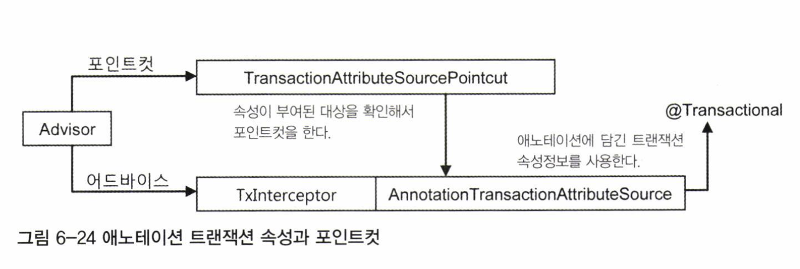

# 6.7 애노테이션 트랜잭션 속성과 포인트컷

포인트컷 표현식과 트랜잭션 속성을 이용해 트랜잭션을 일괄적으로 적용하는 방식은 복잡한 트랜잭션 속성이 요구되지 않는 한 대부분의 상황에 잘 들어맞는다. 그런데 가끔은 클래스나 메소드에 따라 제각각 트랜잭션 속성을 부여해야하는 경우도 있다.

이런 세밀한 트랜잭션 속성의 제어를 위해 트랜잭션 속성정보를 가진 `@Transactional` 애노테이션을 제공한다.

## 6.7.1 트랜잭션 애노테이션

### @Transactional

다음은 @Transactional 애노테이션을 정의한 코드다.

```java
@Target({ElementType.METHOD, ElementType.TYPE})
@Retention(RetentionPolicy.RUNTIME)
@Inherited
@Documented
public @interface Transactional {
  String value() default "";
  Propagation propagation() default Propagation.REQUIRED;
  Isolation isolation() default Isolation.DEFAULT;
  int timeout() default TransactionDefinition.TIMEOUT_DEFAULT;
  boolean readOnly() default false;
  Class<? extends Throwable[]> rollbackFor() default {};
  String[] rollbackForClassName() default {};
  Class<? extends Throwable[]> noRollbackFor() default {};
  String[] noRollbackForClassName() default {};
}
```

@Transactional 애노테이션의 타깃은 메소드와 타입이다. 따라서 메소드, 클래스, 인터페이스에 사용할 수 있다. @Transactional 애노테이션을 트랜잭션 속성정보로 사용하도록 지정하면 스프링은 @Transactional이 부여된 모든 오브젝트를 자동으로 타깃 오브젝트로 인식한다. 이때 사용되는 포인트컷은 `TransactionAttributeSourcePointcut` 이다. 해당 포인트 컷은 스스로 표현식과 같은 선정기준을 갖고 있지 않지만 @Transactional이 부여된 빈 오브젝트를 모두 찾아서 포인트컷의 선정 결과로 돌려준다. @Transactional은 기본적으로 트랜잭션 속성을 정의하는 것이지만, 동시에 `포인트컷의 자동등록에도 사용된다.`

### 트랜잭션 속성을 이용하는 포인트컷

다음 그림은 @Transactional 애노테이션을 사용했을 때 어드바이저의 동작방식을 보여준다. TransactionInterceptor는 메소드 이름 패턴을 통해 부여되는 일괄적인 트랜잭션 속성정보 대신 @Transactional 애노테이션의 속성을 가져오는 `AnnotationTransactionAttributeSource`를 사용한다. 이로인해 매우 유연한 트랜잭션 속성 설정이 가능해진다.



트랜잭션 부가기능 적용 단위는 메소드다. 따라서 메소드마다 @Transactional을 부여하고 속성을 지정할 수 있다. 이렇게 하면 유연한 속성 제어는 가능하겠지만 코드는 지저분해지고, 동일한 속성정보를 가진 @Transactional 애노테이션을 반복적으로 메소드마다 부여해줘야하는 번거로움이 생긴다.

### 대체 정책

그래서 스프링은 @Transactional을 적용할 때 4단계의 대체 정책을 이용하게 해준다. 메소드의 속성을 확인할 때 타깃 메소드, 타깃 클래스, 선언 메소드, 선언 타입의 순서에 따라서 @Transactional이 적용됐는지 차례로 확인하고, 가장 먼저 발견되는 속성정보를 사용하게 하는 방법이다.

```java

//[1]
public interface Service {
  //[2]
  void method1();
  //[3]
  void method2();
}

//[4]
public class ServiceImpl implements Service {
  //[5]
  @Override
  public void method1() { }
  //[6]
  @Override
  public void method2() { }
}
```

스프링은 트랜잭션 기능이 부여될 위치인 타깃 오브젝트의 메소드부터 시작해서 @Transactional 애노테이션이 존재하는지 확인한다. 따라서 [5], [6]이 첫 번째 후보다. 여기서 애노테이션이 발견되면 바로 애노테이션의 속성을 가져다 해당 메소드의 트랜잭션 속성으로 사용한다.

메소드에서 @Transactional을 발견하지 못하면, 다음은 타깃 클래스인 [4]에 @Transactional이 존재하는지 확인한다. 이를 통해서 해당 클래스의 모든 메소드의 공통적으로 적용되는 속성이 될 수 있다. 메소드 레벨에 @Transactional이 없다면 모두 클래스 레벨의 속성을 사용할 것이기 때문이다.

₩타깃 클래스에서도 @Transactional을 발견하지 못하면, 스프링은 메소드가 선언된 인터페이스로 넘어간다.인터페이스에서도 메소드를 먼저 확인한다. 따라서 [2], [3]에 @Transactional이 부여됐는지 확인하고 있다면 이 속성을 적용한다. 인터페이스 메소드에도 없다면 마지막 단계인 인터페이스 타입 [1]의 위치에 애노테이션이 있는지 확인한다.

## 6.7.2 트랜잭션 애노테이션 적용

세밀한 트랜잭션 설정이 필요하지 않더라도 @Transactional을 이용하는 것이 훨씬 편리하고 코드를 이해하기도 좋다.

다만 트랜잭션 적용 대상을 손쉽게 파악할 수 없고, 사용 정책을 잘 만들어두지 않으면 무분별하게 사용되거나 자칫 빼먹을 위험도 있다. 만약 트랜잭션이 적용되지 않을 경우 해당 사실을 파악하는 것은 매우 힘들다. 따라서 @Transactional을 사용할 때는 실수하지 않도록 주의하고, @Transactional 적용에 대한 별도의 코드 리뷰를 거칠 필요가 있다.

tx 스키마의 <tx:attributes> 태그를 이용해 설정했던 트랜잭션 속성을 그대로 애노테이션으로 바꿔보자.

```xml
<tx:attributes>
  <tx:method name="get*" read-only="true" />
  <tx:method name="*" />
</tx:attributes>
```

애노테이션을 이용할 때는 이 두 가지 속성 중에서 많이 사용되는 한 가지를 타입 레벨에 공통 속성으로 지정해주고, 나머지 속성은 개별 메소드에 적용해야 한다.

```java
@Transactional
public interface UserService {
  void add(User user);
  void deleteAll();
  void update(User user);
  void upgradeLevels();
  
  @Transactional(readOnly = true)
  User get(String id);

  @Transactional(readOnly = true)
  List<User> getAll();
}
```

