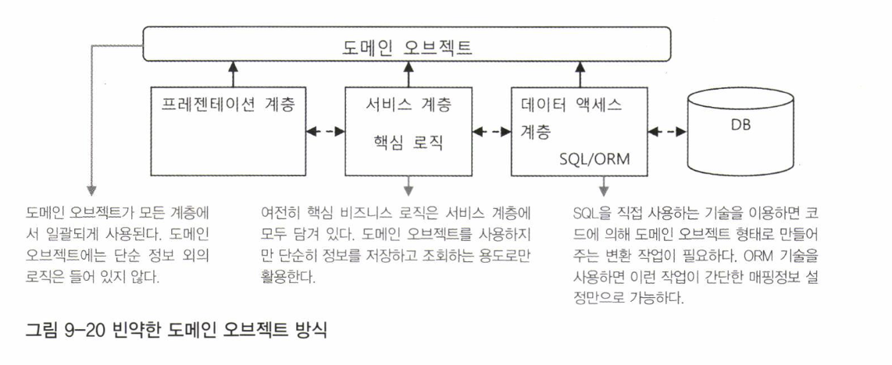
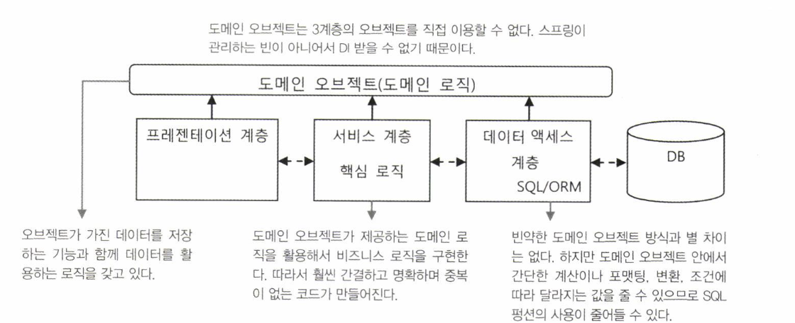

# 9.3.3 오브젝트 중심 아키텍처

오브젝트 중심 아키텍처란 오브젝트를 만들어두고 오브젝트 구조 안에 정보를 담아서 각 계층 사이에 전달하게 만드는 것이다.

## 데이터와 오브젝트

간단한 예를 가지고 데이터와 오브젝트 방식을 비교해보자.

하나의 카테고리에 여러 개의 상품이 포함되는 도메인 모델이다. 전형적인 1:N의 관계다.


이를 DB 테이블로 만들면 두 테이블 사이에 관계를 만들어주는 외래키를 하나 둬야한다.


조건에 맞는 모든 카테고리와 상품 정보를 가져와서 화면에 출력하는 기능을 만든다고 해보자. 이때 데이터 중심 아키텍처에서는 SQL과 DB 관점에서 생각한다. 이 두 개의 정보를 조합해서 가져오기위해 DAO에서 JOIN 문을 사용하는 SQL을 사용하게 만들 것이다. SQL 실행 결과는 맵이나 배열에 담는다.

```java
while(rs.next()) {
  Map<String, Object> resMap = new HashMap<>();
  resMap.put("categoryId", rs.getString(1));
  resMap.put("description", rs.getString(2));
  //  ...
  list.add(resMap);
}
```

서비스 계층에 전달되는 것은 List<Map<String, Object>> 타입이다. 이 타입만 봐서는 안에 담긴 내용이 어떤 것인지 알 수 없다. 따라서 이 결과를 사용하는 서비스 계층이나 프레젠테이션 계층의 코드에서는 DAO 메소드에서 어떠한 SQL을 사용하여 어떤 결과값을 반환하는지 알아야 사용할 수 있다.

이렇게 데이터 중심의 아키텍처에서는 DAO가 만드는 SQL의 결과에 모든 계층의 코드가 의존하게 된다.

반면에 오브젝트 방식에서는 애플리케이션에서 사용되는 정보가 도메인 모델의 구조를 반영해서 만들어진 오브젝트 안에 담긴다. 따라서 전 계층에서 일관된 구조를 유지한 채로 사용될 수 있다.

먼저 도메인 모델의 클래스를 정의한다.

```java
public class Category {
  int categoryId;
  String description;
  Set<Product> products;
}

public class Product {
  int productId;
  String name;
  int price;
  Category category;
}
```

이 구조는 단순히 특정 SQL에 대응되는 맵과 배열, 매번 달라지는 SQL 결과를 담기 위해 급조해서 만든 오브젝트와는 달리, 애플리케이션 어디에서도 사용될 수 있는 일관된 형식의 도메인 정보를 담고 있다.

데이터 중심 방식에서는 Category와 그에 대응되는 Product를 찾아 SQL을 이용해 조인한 다음 하나의 맵에 뭉뚱그려서 가져왔다. 반면에 오브젝트 중심 방식에선느 테이블의 정보와 그 관계를 유지한 채로 정확한 개수의 Category 오브젝트와 그에 대응되는 Product 오브젝트로 만들어 사용한다. 이 두 가지 오브젝트는 레퍼런스 변수를 통해 서로 연결되어 있기 때문에 메소드 파라미터나 리턴 값으로 전달할 때 Category 오브젝트 하나를 전달하더라도 그에 연결된 Product 리스트가 함께 전달된다.

이렇게 도메인 모델을 따르는 오브젝트 구조를 만들려면 DB에서 가져온 데이터를 도메인 오브젝트 구조에 맞게 변환해줄 필요가 있다.

## 도메인 오브젝트를 사용하는 코드

오브젝트 중심 방식에서 비지니스 로직의 구현이 얼마나 간단하고 명확한지 살펴보자. 어떤 카테고리에 포함된 상품의 모든 가격을 계산해야 하는 로직이 필요하다면 다음과 같은 메소드를 만들어 사용하면 된다.

```java
public int calcTotalOfProductPrice(Category category) {
  int sum = 0;
  for (Product product : category.getProducts()) {
    sum += product.getPrice();
  }
  return sum;
}
```

도메인 모델을 알고 있다면 해당 메소드가 무슨 작업을 하는지 이해하기 어렵지 않다.

반면에 데이터 중심 방식에서라면 이런 식의 재사용 가능한 메소드를 만들어 사용하기가 쉽지 않다.

## 도메인 오브젝트 사용의 문제점

도메인 모델을 따르는 오브젝트로 정보를 다루면 장점이 많다. 하지만 단점도 존재한다. 최적화된 SQL을 매번 만들어 사용하는 경우에 비해 성능 면에서 조금은 손해를 감수해야 할 수도 있다. DAO는 비지니스 로직의 사용 방식을 알지 못하므로, 도메인 오브젝트의 모든 필드 값을 다 채워서 전달하는 경우가 대부분이다. 그런데 하나의 오브젝트에 담긴 필드의 개수가 많아지다 보면 그중에는 드물게 사용되는 필드도 있을 수 있다. 어떤 비지니스 로직에서 필요한 정보가 몇 개의 필드뿐이라면 모든 필드 정보를 채워서 전달하는 것은 낭비일 수도 있다.

오브젝트 관계에도 문제가 있다. 단순히 Product 정보만 필요하더라도 Category 오브젝트가 함께 담겨있기 때문에 전부 다 조회해야 하는 문제가 있다.

이런 문제를 해결하는 접근 방법은 여러 가지가 있다.

지연된 로딩 기법을 이용하면 일단 최소한의 오브젝트 정보만 읽어두고 관계하고 있는 오브젝트가 필요한 경우에만 다이나믹하게 DB에서 다시 읽어올 수 있다.

가장 이상적인 방법은 JPA나 JDO, 하이버네이트, TopLinK와 같은 ORM 기술을 사용하는 것이다. 이런 데이터 엑세스 기술은 기본적으로 지연된 로딩 기법 등을 제공해주기 때문에 번거로운 코드를 만들지 않고도 도메인 오브젝트의 생성을 최적화할 수 있다. 또한 SQL 결과를 가지고 도메인 오브젝트의 값을 채우는 등의 복잡한 DAO 코드를 만들지 않아도 되며, 캐싱 기능도 제공한다.

그래서 도메인 오브젝트를 사용하는 오브젝트 중심 아키텍처에서는 가능하다면 ORM과 같은 오브젝트 중심 데이터 엑세스 기술을 사용하는 것을 권장한다.

## 빈약한 도메인 오브젝트 방식

도메인 오브젝트에 정보만 담겨 있고, 정보를 활용하는 아무런 기능도 갖고 있지 않은 오브젝트를 빈약한 오브젝트라고 부른다.

아마도 스프링을 사용하는 개발자가 흔히 사용하는 방식이 이 빈약한 도메인 오브젝트 방식이 아닐까 싶다. 

도메인 오브젝트에 넣을 수 있는 기능은 어떤 것일까? 도메인 모델을 반영해서 만들어진 도메인 오브젝트이니 그 기능이라고 하면 도메인의 비지니스 로직이라고 볼 수 있다. 도메인 오브젝트는 3개의 계층에는 독립적으로 존재하면서 일관된 구조의 정보를 담아서 계층 간에 전달하는 데 사용된다.



빈약한 도메인 오브젝트 방식의 한계는 거대 서비스 계층 방식과 유사하다.

하지만 비지니스 로직이 복잡하지 않다면 가장 만들기 쉽고 3계층 구조의 특징을 잘 살려서 개발할 수 있는 유용한 아키텍처다.

## 풍성한 도메인 오브젝트 방식

풍성한 도메인 오브젝트 또는 영리한 도메인 오브젝트 방식은 빈약한 도메인 오브젝트의 단점을 극복하고 객체지향적인 특징을 잘 사용할 수 있도록 개선한 것이다.

앞에서 서비스 계층의 코드로 만들었던 calcTotalOfProductPrice() 는 Category 라는 오브젝트와 그 관련 Product의 정보만을 사용하는 간단한 로직이다. 이것을 굳이 서비스 계층에 두지 않고 Category 클래스의 메소드에 넣을 수도 있다.

```java
public class Category {
  List<Product> products;
  
  public int calcTotalOfProductPrice() {
    int sum = 0;
    for (Product product : this.products) {
      sum += product.getPrice();
    }    
    return sum;
  }
}
```

이렇게 도메인 오브젝트 안에 로직을 담아두면 이 로직을 서비스 계층의 메소드에 따로 만드는 경우보다 응집도가 높다.

이렇게 도메인 오브젝트에 비지니스 로직을 넣는다고 하더라도 도메인 계층은 직접 데이터 엑세스 계층이나 다른 서비스 계층의 오브젝트에 접근할 수 없기 때문에 서비스 계층이 필요하기도 하다.

왜 도메인 오브젝트는 DAO 오브젝트를 DI 받을 수 없을까? 그것은 도메인 오브젝트는 스프링 컨테이너가 관리하는 오브젝트, 즉 빈이 아니기 때문이다. DI를 받으려면 자신도 스프링 컨테이너에 의해 관리되는 빈이어야 한다. 이러한 이유로 도메인 오브젝트는 DI를 받을 수 없다.

그래서 수식 계산이나 조건에 따른 데이터의 변경 등에 국한된 로직은 도메인 오브젝트 안에 추가할 수 있지만, DB가 직접적으로 필요한 작업은 도메인 오브젝트에서 불가능하다. 그래서 서비스 계층의 코드가 필요한 것이다.

풍성한 도메인 오브젝트 방식의 아키텍처를 나타낸다. 스프링의 빈으로 관리되는 3계층의 오브젝트들은 도메인 오브젝트를 자유롭게 이용할 수 있지만 그 반대는 안된다는 사실을 주의해야 한다.



## 도메인 계층 방식

도메인 오브젝트가 스스로 필요한 정보는 DAO를 통해 가져올 수 있고, 생성이나 변경이 일어났을 때 직접 DAO에게 변경사항을 반영해달라고 요청할 수는 없을까? 계층 오브젝트를 DI 받을 수는 없을까?

그래서 등장한 것이 바로 도메인 오브젝트가 기존 3계층과 같은 레벨로 격상되어 하나의 계층을 이루게 하는 도메인 계층 방식이다. 개념은 간단하다. 도메인 오브젝트들이 하나의 독립적인 계층을 이뤄서 서비스 계층과 데이터 엑세스 계층의 사이에 존재하게 하는 것이다.

도메인 오브젝트가 독립된 계층을 이뤘기 때문에 기존 방식과는 다른 두 가지 특징을 갖게 된다.

첫 번째 특징은 비지니스 로직의 처리가 도메인 계층의 오브젝트 안에서 진행된다.

두 번째 특징은 도메인 오브젝트가 기존 데이터 엑세스 계층이나 기반 계층의 기능을 직접 활용할 수 있다는 것이다.

스프링이 관리하지 않는 도메인 오브젝트에 DI를 적용하기 위해서는 AOP가 필요하다. 이를 이용해서 도메인 오브젝트가 생성되는 시점에 특별한 부가기능을 추가하게 만들어줄 수 있다.

이 방법을 이용하면 도메인 오브젝트가 만들어질 때 스프링의 빈 오브젝트를 DI 받게 할 수 있다.

도메인 오브젝트를 독립적인 계층으로 만들려고 할 때 고려해야 할 중요한 사항이 있다. 도메인 오브젝트가 도메인 계층을 벗어나서도 사용되게 할지 말지 결정해야 한다. 도메인 오브젝트가 계층을 이루기 전에는 모든 계층에 걸쳐 사용되는 정보 전달 도구 같은 역할을 했지만 독자적인 계층을 이룬다면 상황이 달라질 수 있다.

선택할 수 있는 방법은 두 가지가 있다.

첫 번째는 여전히 모든 계층에서 도메인 오브젝트를 사용한다. 도메인 모델을 따르는 오브젝트 구조를 활용하는 면에서 오브젝트 중심 아키텍처의 장점을 그대로 누릴 수 있다. 하지만 여러 계층에서 남용하게 된다면 의도치 않은 비지니스 로직 호출 등의 문제를 유발할 수 있다.

두 번째는 도메인 오브젝트는 도메인 계층을 벗어나지 못하게 하는 것이다. 도메인 계층 밖으로 전달될 때는 별도로 준비된 정보 전달용 오브젝트에 도메인 오브젝트의 내용을 복사해서 넘겨줘야 한다. 이런 오브젝트는 데이터 전달을 위해 사용된다고 해서 DTO 라고 불린다.


## DTO와 리포트 쿼리

도메인 계층 방식의 경우 도메인 계층을 벗어난 정보를 DTO라 불리는 특정 계층에 종속되지 않는 정보 전달의 목적을 가진 단순 오브젝트에 담아 사용하기도 한다. 그 외의 방법에서도 DTO의 사용이 꼭 필요할 때가 있다.

대표적인 예는 리포트 쿼리라고 불리는 DB 쿼리의 실행 결과를 담는 경우다. 리포트 쿼리는 여러 테이브렝 걸쳐 존재하는 자료를 분석하고 그에 따른 분석/통계 결과를 생성하는 쿼리라는 의미다. 이런 쿼리의 결과는 DB 테이블에 담긴 필드의 내용보다는 합계, 평균 과 같은 계산 값 혹은 여러 테이블의 필드를 조합해서 만들어진다. 따라서 해당 쿼리 실행 결과를 담을만한 도메인 오브젝트를 찾을 수 없기 때문에 DTO 또는 맵에 담아서 전달해야 한다.